# OpenGD77 / OpenGD77S / OpenDM1801 / OpenRD5R User Guide

For the latest information and discussions, please refer to the development and community forum at <https://opengd77.com>

<!-- TOC titleSize:2 tabSpaces:2 depthFrom:1 depthTo:6 withLinks:1 updateOnSave:1 orderedList:0 skip:0 title:1 charForUnorderedList:* -->

## Table of Contents
* [OpenGD77 / OpenGD77S / OpenDM1801 / OpenRD5R User Guide](#opengd77--opengd77s--opendm1801--openrd5r-user-guide)
  * [Introduction](#introduction)
    * [Download links and other resources](#download-links-and-other-resources)
  * [Installation](#installation)
  * [Transferring data to Radio](#transferring-data-to-radio)
  * [Codeplug compatibility](#codeplug-compatibility)
  * [Variations between different supported radios](#variations-between-different-supported-radios)
  * [Main screens (VFO and Channel screens)](#main-screens-vfo-and-channel-screens)
    * [Changing between FM and DMR](#changing-between-fm-and-dmr)
    * [Changing Timeslot in DMR mode](#changing-timeslot-in-dmr-mode)
    * [Controlling Tx power](#controlling-tx-power)
    * [Signal strength bar graph](#signal-strength-bar-graph)
    * [Channel screen specific functionality](#channel-screen-specific-functionality)
      * [Changing channels within the current zone](#changing-channels-within-the-current-zone)
      * [Changing zones](#changing-zones)
	  * [Displaying the channel Frequency](#displaying-the-channel-frequency)
      * [Displaying FM specific channel information](#displaying-fm-specific-channel-information)
      * [Listening on a repeater input](#listening-on-a-repeater-input)
      * [Channel Quick Menu](#channel-quick-menu)
        * [Copying a channel to VFO](#copying-a-channel-to-vfo)
        * [Read the VFO into the current channel](#read-the-vfo-into-the-current-channel)
        * [Filter](#filter)
      * [VFO Quick Menu](#vfo-quick-menu)
        * [VFO selection A or B](#vfo-selection-a-or-b)
        * [Exchange the TX and RX frequencies](#exchange-the-tx-and-rx-frequencies)
        * [Copy the RX frequency to the TX frequency](#copy-the-rx-frequency-to-the-tx-frequency)
        * [Copy TX frequency to the RX frequency](#copy-tx-frequency-to-the-rx-frequency)
        * [Filter](#filter)
        * [VFO to New Channel](#vfo-to-new-channel)
        * [Tone Scan for CTCSS or DCS tone in FM](#tone-scan-for-ctcss-or-dcs-tone-in-fm)
        * [Dual Watch](#dual-watch)
        * [Binding Transmit and Receive frequencies](#binding-transmit-and-receive-frequencies)
    * [DMR specific functionality (VFO and Channel screens)](#dmr-specific-functionality-vfo-and-channel-screens)
      * [Timeslot selection](#timeslot-selection)
      * [DMR ID callsign and name display](#dmr-id-callsign-and-name-display)
      * [Talker Alias display](#talker-alias-display)
      * [Talkgroup selection from the Rx Group list](#talkgroup-selection-from-the-rx-group-list)
      * [Assignment of Timeslot to Digital Contact TalkGroup](#assignment-of-timeslot-to-digital-contact-talkgroup)
      * [TalkGroup displayed in inverse video](#talkgroup-displayed-in-inverse-video)
      * [Manual TalkGroup number entry](#manual-talkgroup-number-entry)
      * [Private Call number entry](#private-call-number-entry)
      * [Digital Contact selection](#digital-contact-selection)
      * [Station DMR ID number entry](#station-dmr-id-number-entry)
    * [FM specific functionality (VFO and Channel screens)](#fm-specific-functionality-vfo-and-channel-screens)
      * [FM and FM Narrow](#fm-and-fm-narrow)
      * [CTCSS Tone or DCS Code](#ctcss-tone-or-dcs-code)
      * [Squelch](#squelch)
      * [1750Hz Tone for repeater operation](#1750hz-tone-for-repeater-operation)
      * [DTMF tone transmission](#dtmf-tone-transmission)
    * [VFO specific functionality](#vfo-specific-functionality)
      * [Frequency change up/down step](#frequency-change-updown-step)
      * [Numerical frequency entry](#numerical-frequency-entry)
      * [To adjust the TX frequency, independent of the RX frequency](#to-adjust-the-tx-frequency-independent-of-the-rx-frequency)
  * [Monitor mode](#monitor-mode)
  * [Transmitting](#transmitting)
    * [Timeout warning beep](#timeout-warning-beep)
    * [TOT](#tot)
  * [Scanning](#scanning)
    * [Channel scanning](#channel-scanning)
    * [VFO scanning](#vfo-scanning)
  * [Other screens](#other-screens)
    * [Lock screen](#lock-screen)
    * [Text entry](#text-entry)
  * [The control keys and buttons](#the-control-keys-and-buttons)
  * [The Menu System](#the-menu-system)
  * [Main Menu](#main-menu)
    * [Zone](#zone)
    * [RSSI](#rssi)
    * [Radio Info](#radio-info)
    * [Last Heard](#last-heard)
    * [Firmware Info](#firmware-info)
    * [Options](#options)
      * [Band Limits](#band-limits)
      * [Key long](#key-long)
      * [Key rpt](#key-rpt)
      * [Filter time](#filter-time)
      * [Scan delay](#scan-delay)
      * [Scan dwell](#scan-dwell)
      * [Scan mode](#scan-mode)
      * [Squelch UHF](#squelch-uhf)
      * [Squelch 220](#squelch-220)
      * [Squelch VHF](#squelch-vhf)
      * [PTT Latch](#ptt-latch)
      * [Hotspot](#hotspot)
      * [TA Tx](#ta-tx)
      * [Allow PC](#allow-pc)
      * [User Power](#user-power)
      * [Temp Cal](#temp-cal)
      * [Bat Cal](#bat-cal)
      * [Eco Level](#eco-level)
    * [Display Options](#display-options)
      * [Brightness](#brightness)
      * [Min Bright](#min-bright)
      * [Contrast](#contrast)
      * [Display mode](#display-mode)
      * [Timeout](#timeout)
      * [Colour mode](#colour-mode)
      * [Order](#order)
      * [Contact](#contact)
      * [Battery units](#battery-units)
      * [Info](#info)
      * [Leds](#leds)
    * [Sound Options](#sound-options)
      * [Timeout beep](#timeout-beep)
      * [Beep volume](#beep-volume)
      * [DMR Beep](#dmr-beep)
      * [DMR mic](#dmr-mic)
      * [FM mic](#fm-mic)
      * [VOX threshold](#vox-threshold)
      * [VOX Tail](#vox-tail)
      * [Prompt](#Prompt)
    * [Channel Details](#channel-details)
      * [Mode](#mode)
      * [Color Code](#color-code)
      * [Timeslot](#timeslot)
      * [Tx/RX Grp](#txrx-grp)
      * [Tx CTCSS or DCS](#tx-ctcss-or-dcs)
      * [Rx CTCSS or DCS](#rx-ctcss-or-dcs)
      * [Bandwidth](#bandwidth)
      * [RX](#rx)
      * [TX](#tx)
      * [Step](#step)
      * [TOT](#tot)
      * [Zone Skip](#zone-skip)
      * [All Skip](#all-skip)
      * [VOX](#vox)
	  * [Channel Power](#ch-power)
      * [Accepting and saving the changes to the channel](#accepting-and-saving-the-changes-to-the-channel)
    * [Credits Screen](#credits-screen)
	
  * [User definable number key functionality QuickKeys](#user-definable-number-key-functionality-quickkeys) 	
  * [Making and receiving DMR Private Calls](#making-and-receiving-dmr-private-calls)
    * [To make a Private Call](#to-make-a-private-call)
    * [To Receive a Private Call](#to-receive-a-private-call)
  * [Hotspot mode](#hotspot-mode)
  * [Resetting the Settings](#resetting-the-settings)
  * [GD-77S operation](#gd-77s-operation)
    * [GD77S Channel / TG mode](#gd77s-channel--tg-mode)
    * [GD77S Scan mode](#gd77s-scan-mode)
    * [GD77S Timeslot mode](#gd77s-timeslot-mode)
    * [GD77S Color Code mode](#gd77s-color-code-mode)
    * [GD77S DMR Filter mode](#gd77s-dmr-filter-mode)
    * [GD77S Zone mode](#gd77s-zone-mode)
    * [GD77S Power mode](#gd77s-power-mode)
  * [CPS software](#cps-software)
    * [Overview](#overview)
      * [New Driver Installation](#new-driver-installation)
      * [OpenGD77 Menu](#opengd77-menu)
      * [IMPORTANT FIRST STEP: Backup First](#backup-before-you-do-anything-else)
      * [Reading and Writing Your Codeplug](#reading-and-writing-your-codeplug)
      * [Writing DMR IDs -- the User Database](#writing-dmr-ids----the-user-database)
	  * [Boot Tune](#boot-tune)
	    * [Boot Tune in Morse code](#boot-tune-in-morse-code)
	  * [Melodies and Notes](#melodies-and-notes)
	  * [Boot Image](#boot-image)
   * [Voice prompts](#voice-prompts)
   * [Hardware problems and other errata](#hardware-problems-and-other-errata)
<!-- /TOC -->

## Introduction

This user guide is a work in progress as is the OpenGD77, OpenGD77S, OpenDM1801 and OpenRD5R firmware.

Due to the rapid pace of development some photos of screens are now out of date and not completely accurate.

The photos will be updated when the firmware in a particular area stabilises.

The intention of the project is to create a fully featured non-commercial firmware that entirely replaces the Radioddity GD-77, and Baofeng DM-1801 factory firmware.
This firmware is specifically designed for **Amateur Radio** use, and has features not available in the official firmware.
The license forbids commerial use of this firmware.

*Note:*

- **The firmware is still under development and there are some key areas of functionality which are supported in the official firmware but not in this firmware**
- SMS message Tx and Rx **are not currently supported**, but may possibly be supported in the future.
- Scan Lists **are not supported** because Channel or Zone scan feature provides almost identical functionality.
- Privacy and Encryption **will not** be supported, as its illegal for Amateur Radio use, developers in some countries (*e.g.* Australia) are now legally required to put a back door access into any encryption systems at the request of the government, hence effectively making it illegal or impossible to develop systems that contain encryption.

### Download links and other resources

**Firmware binaries:**

- **Latest version:**
<https://github.com/rogerclarkmelbourne/OpenGD77/releases>

- **OpenGD77 CPS with support of new features like 80 channel zones:**
<https://github.com/rogerclarkmelbourne/OpenGD77CPS/releases>

- **OpenGD77Forum:**
<https://www.opengd77.com/>

## Installation

The firmware can be installed onto the following radios

- Radioddity GD-77 (also known as TYT MD-760)
- Radioddity GD-77S
- Baofeng DM-1801 (also known as Baofeng DM-860)
- Baofeng RD-5R (also known as Baofeng DM-5R Tier 2)

The firmware can easy be loaded using the [CPS software](#cps-software), or by using the firmware update tool provided by Radioddity or Baofeng, with their official firmware update packages. This can be downloaded from Radioddity’s website [radioddity.com](https://radioddity.com/) (*see Radioddity’s documentation on how to use their firmware update tool)*

Installation of the firmware is undertaken at the owners own risk, but the official firmware can usually be reloaded onto the radio if the user has problems with the firmware, **as long as the operator takes a full backup of their radio using the CPS immediately after the firmware has been installed** (see [*backup section*](#backup-before-you-do-anything-else))

*Note:*

- The official Radioddity CPS PC software is not compatible with the firmware, and the **OpenGD77 CPS** should be used instead. This can be downloaded from the link show in [section 1.1](#download-links-and-other-resources) of this guide. This CPS must also be used for the Baofeng DM-1801 and RD-5R

### Transferring data to Radio

There are two mechanisms that can be used when connecting your computer to the radio.

1. Firmware upgrade.
 - Get the radio into device firmware update mode (aka DFU) mode by:
   * Holding down the two buttons indicated below (**S1**,**Fn**) and turning the radio on.
   * The LCD screen will be blank.
   * Connection will use the HID codes and a driver is not required to be installed.
     - Radioddity GD-77 or GD-77s or the TYT MD-760 or MD-730:
       * Hold down the **two small buttons** next to the PTT button.
     - Baofeng DM-1801 or DM-860:
       * Hold down the **two small buttons** under the PTT button.
     - Baofeng RD-5R or DM-5R Tier2:
       * The Orange **S1** (Call) and Black Fn (**Moni** or **S2**) buttons (either side of the PTT).  
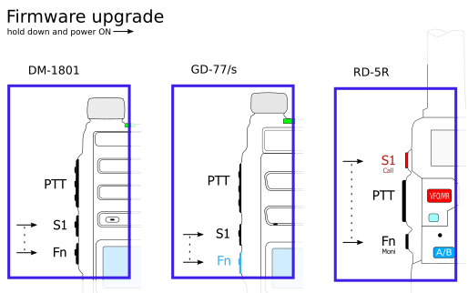<!-- { width=410 } -->

       * The Firmware is easily installed from the Extras menu in the [CPS](#cps-software).
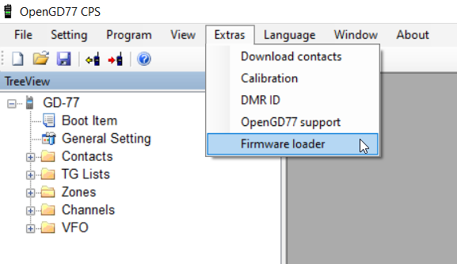

       * Choose Your radio model.                        
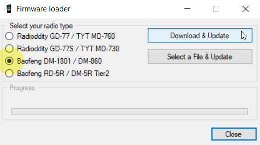

       * If you choose **Download and Update** then you can select from the Stable or Unstable branches.         
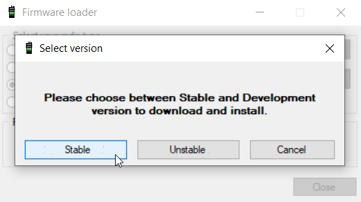<!-- { width=350 } -->

2. Updating the codeplug using [OpenGD77 CPS](#cps-software).
 - This mechanism uses serial communication while the radio is normally on with the LCD active.
   * If you have been updating the firmware then turn the radio off and turn it on normally.
   * It uses serial ports so the OpenGD77 driver must be installed. This happens as part of the installation of the CPS software.
   * Specific Detail in [CPS section](#backup-before-you-do-anything-else)

## Codeplug compatibility

The official firmware for each of these radios use slightly different codeplug formats.

Users of radios other than the GD-77 will need to convert their codeplug using the tools written by Colin G4EML (see <http://www.gb3gf.co.uk/downloads.html>).

Specifically export their existing codeplug to CSV format, and then import those CSV files into the OpenGD77 version of Colin's tools.

The codeplug can only be uploaded to the firmware using the [OpenGD77CPS](#cps-software).

It's also recommended that you restructure your codeplug to remove any duplicate channels which are the same frequency but use different TalkGroup. See the section about [*Programming Channels and Talkgroups for use with the firmware*](#overview) at the end of this User Guide.

## Variations between different supported radios

Not all the supported radios have the same number of buttons, or the same screen size, hence there are some differences when operating radios other than the Radioddity GD-77.

Also, not all radios support all the functionalities.

- The Radioddity GD-77 (aka *TYT MD-760*), has 2 buttons below the PTT. The **black** button is technically known as **SK1**, and the **blue** button is known as **SK2** and is also referred to, in this manual, as the **Function** button. This radio also has an **Orange** button at the top.
- The Baofeng RD-5R / DM-5R USB hardware will not support USB connections while the radio is transmitting, so **it is not possible** to use Hotspot mode on this radio.
- The Baofeng RD-5R / DM-5R does not have left or right arrow buttons, so the **A/B** button is used to replace the left arrow and the **Band** button is used to replace the right arrow.
- The Baofeng RD-5R / DM-5R does not have the **Orange** button, and its functionality has been simulated by using a **Long press** on the orange coloured **MR/VFO** button.
- The Baofeng RD-5R / DM-5R has 2 buttons on the side, but their position is different from the GD-77 and DM-1801. The button above the PTT is used as the **Black** button on the side of the GD-77, also known as button **SK1**. The button below the PTT is used as the **Function** button, also known as **SK2**.
- The Radioddity GD-77S does not have a keypad or screen, hence its operation is completely different from the other supported radios that have a screen (*see the appendix on [GD-77S operation](#gd-77s-operation)*).
- The Baofeng DM-1801 / DM-860 has a dedicated **MR/VFO** button, which is used to change between Channel and VFO mode, in place of pressing the **Red** menu key.
- The Baofeng DM-1801 / DM-860 has a dedicated **A/B** button, which is used to change between VFO A and B, in place of pressing the quick menu via the **Orange** button on the top of the radio.

## Main screens (VFO and Channel modes)

The firmware has 2 main screens, the VFO screen and the Channel screen. These are similar to the Channel and VFO screens in the official firmware, except having additional functionalities.

Initially after the firmware is installed, the VFO screen will be displayed.

The frequency used in the VFO for both Tx and Rx will be read from the *VFO A* settings of the codeplug.

On both the VFO and Channel screens, the mode (**DMR** or **FM**) is shown in the top left of the display, and the battery voltage or percentage is shown in the top right of the display.

In **DMR** mode, the current *TimeSlot* is shown to the right of the **DMR** text, *e.g.* **TS2** for TimeSlot 2, and the *Color Code*, *e.g.* **C1** for Color Code 1, is shown to the left of the battery voltage / percentage. When TimeSlot [filtering](#ts-filter-dmr-mode-only)) is turned off, the **TS1** or **TS2** indicator is in inverse color.

The current Tx power is shown in the middle of the top of the screen (*e.g.* 750mW).

On the **VFO** screen, the TX and RX frequency are shown, as well as the TalkGroup when in DMR mode.

The arrow to the left of the **R** (receive frequency) indicates that the keypad up and down arrows and number entry keys will control the RX frequency.

The channel screen displays the same information in the top row, but displays the **Channel name** (in this example __*Lee Hill*__) as well as the **Zone** (__*Home DMR*__).

In DMR mode the **TalkGroup** (in this case __*ColoradoHD*__), will also be displayed.

On both the VFO and Channel screens:

- Press the **Red** menu button to toggle between the VFO and Channel screens (*Note:* on radios like the Baofeng DM-1801 and RD-5R, press the **MR/VFO** button to toggle between Channel and VFO mode).
- Press the **Green** menu key to enter the menu system.
- Press **Function + Green** for quick access to the [Channel details](#channel-details) screen, which can also be accessed via the menu system.

*Note:*

- The VFO is actually a special type of Channel; hence the [Channel Details](#channel-details) screen also works for the VFO.

### Changing between FM and DMR

- Press the **Function** + **Star** keys to toggle between FM and DMR mode, on either the **VFO** or **Channel** screens.

### Changing Timeslot in DMR mode

- In DMR mode, pressing the **Star** key toggles between *TimeSlot 1* and *TimeSlot 2*.

### Controlling Tx power

The firmware has two main ways to control the output power:

1. The **Master** power control, which controls the power to both VFOs, and also all channels.
2. **Channel** specific power.

By default, all Channels are set to use the **Master** power, however this setting can be changed in the CPS (and also in the **Channel Details** screen), so that individual channels have their own custom power setting.

When a Channel has a custom power setting, the power will be displayed in a **Bold font**.

Increasing and decreasing the power on a Channel with a custom power setting will temporarily override the power on the Channel, but this change is not saved to the codeplug. So, changing channels will result in the temporary override being lost.

To make a **permanent** change to a Channel custom power value, you must open the [**Channel Details**](#channel-details) screen, and then exit by pressing **Function** + **Green**.

Increasing or decreasing the power level on a Channel which uses the **Master** power control, will change the **Master** power level **for all other channels** which use the **Master** power and **also both VFOs**.

Changing the power on **either** VFO also changes the **Master** power setting.

- Press **Function** + **Right** to increase the power.
- Press **Function** + **Left** to decrease the power.

Power can be set to **50mW**, **250mW**, **500mW**, **750mW**, **1W**, **2W**, **3W**, **4W**, **5W** and **+W-**.

The **+W-** power setting configures the PA drive to the value set in the Options screen "User Power" setting.

To access this power setting, select the **5W** power setting, then press and hold **Function** + **Right**

*Notes:*

- The power output will only be correct after the operator has calibrated their own radio, as these radios **do not seem to have very accurate power calibration applied in the factory**.
- Power output on settings below **1W** is **not** very accurate, because the calibration only holds data points for the **1W** and **5W** power values.
- Between **1W** and **5W**, the PA FET output power is approximately directly proportional to the PA drive level, hence the interpolated drive levels result in *reasonably accurate* power levels for **2W**, **3W** and **4W**.
- However, below **1W** the PA FET power output **is not directly proportional** to the PA drive level, and **varies  considerably** between different radios. Hence the power accuracy below **1W** is at best around **80% accurate**.
- Also, the PA FET minimum operational power threshold is very close to (or sometimes even above **50mW**), so operating at this power level **can produce unwanted spurious emissions**.
- Please confirm your power output and spectral emissions **before** using the **50mW** setting anywhere it may cause interference.

### Signal strength bar graph

In both FM and DMR mode, the signal strength of the received signal is shown as a bar graph across the width of the screen.

**100%** bar graph is approximately **S9 +40dB**.

In DMR mode the signal meter **will only be active** when the DMR hardware detects a DMR signal.

In FM mode the signal meter should operate all the time.

*Note:*

- Currently the S meter reading is **not** very accurate because the radio hardware Rx sensitivity is **not calibrated** at the factor.
- Hence the value displayed is based on a radio with average sensitivity, individual radios may be **more or less** sensitive than average, therefore the S meter will read **higher or lower** than is absolutely correct.

### Channel screen specific functionality

The Channel screen displays the current Channel number as well as the current zone.

#### Changing channels within the current zone<!-- linebreak -->

- Pressing the **Up** or **Down** arrow keys changes the Channel in the current zone, and the Channel number in the zone will be displayed beside the zone name.

#### Changing zones<!-- linebreak -->

- Pressing **Function** + **Up** arrow or **Function** + **Down** arrow changes to the next or previous Zone, respectively.

#### Displaying the channel Frequency<!-- linebreak -->

- Press and hold the **SK1** button to display the Rx and Tx frequency in both DMR and FM mode.

#### Displaying FM specific channel information

- Press and hold the **SK1** button to display FM specific information: CTCSS / DCS and squelch setting.

#### Listening on a repeater input

- Pressing the **SK1** button and **Function** button enables the radio to receive on the input to a repeater.

  - This works on both DMR and FM repeaters.
  - This also shows the channel information as described above.

#### Channel Quick Menu<!-- linebreak -->

- Pressing the **Orange** button on the top of the radio in Channel mode displays the Quick Menu for the Channel screen. Note that in Quick Menu, the **Orange** button has the same function as the **Green** key, which confirms your current selection.

*Note:*

- The Baofeng RD-5R does not have an **Orange** button. On this radio press and hold the orange coloured **MR/VFO** button to enter the Quick menu.

##### Copying a channel to VFO<!-- linebreak -->

- Press the **Orange** button or **Green** key to copy the content of the current channel to the VFO.

##### Read the VFO into the current channel<!-- linebreak -->

- Press the **Orange** button or **Green** key to confirm and save the updated channel to the codeplug memory. **Red** key to cancel.

##### Filter
- **Filter** in FM Mode

  - Use the **Right** or **Left** arrows to enable or disable CTCSS / DCS filtering.

- **Filter** in DMR mode

  - Use the **Right** or **Left** arrows to select:

    - **None**: for no filtering, *i.e.* **promiscuous** mode.
    - **TG**: to filter by the selected *Talkgroup*.
    - **Ct**: to filter by *Private Call Contacts* in the codeplug.
    - **RxG**: to filter by *Talkgroups* in the TG list / Rx Group list.

  When this filter is enabled, the *DMR* mode indication at the top of the screen is displayed in inverse video.

- **CC Filter** (*DMR mode only*)
	
  Controls whether the radio filters by *Color Code*.
  
  - Use the **Right** or **Left** arrows to enable or disable.

  When *Color Code* filtering is disabled the *Color Code* number is displayed in inverse video.

- **TS Filter** (*DMR mode only*)
	
  Controls whether the radio filters by *Timeslot*.
  
  - Use the **Right** or **Left** arrows to enable or disable.

  When *Timeslot* filtering is disabled the *Timeslot* number is displayed in inverse video.

#### VFO Quick Menu<!-- linebreak -->

- Pressing the **Orange** button on the top of the radio in VFO mode displays the Quick menu for the VFO screen. Currently this has five options.

*Note:*

- The Baofeng RD-5R does not have an **Orange** button. On this radio press and hold the orange coloured **MR/VFO** button to enter the Quick menu

##### VFO selection A or B<!-- linebreak -->

- Pressing the **Orange** button twice while in VFO mode quickly toggles between **VFO A** and **VFO B**.
- On the Baofeng DM-1801 / DM-860, this function is controlled using the **A/B** button.

##### Exchange the TX and RX frequencies<!-- linebreak -->

This function essentially reverses the TX and RX frequencies.

- Press **Green** key or **Orange** button to confirm.

##### Copy the RX frequency to the TX frequency<!-- linebreak -->

Copies the RX frequency to the TX frequency.

- Press **Green** key or **Orange** button to confirm.

##### Copy TX frequency to the RX frequency<!-- linebreak -->

Copies the TX frequency to the RX frequency.

- Press **Green** key or **Orange** button to confirm.

##### Filter (*DMR mode only*)<!-- linebreak -->

This function is identical to the Filter described for Channel mode operation ([above](#filter))

##### VFO to New Channel<!-- linebreak -->

The **VFO --> New Chan** option, creates a new channel using the current VFO settings.

The name of the new channel uses the format "**New channel** *NNN*", where *NNN* is the next available number in the *All Channels* zone.

The Channel will also be added to the currently active Zone in the Channel screen. If the Channel screen is set to the *All Channels* zone, the channel will be added to that zone.

##### Tone Scan for CTCSS or DCS tone in FM<!-- linebreak -->

This scans for any **CTCSS** or **DCS** tones, and sets the VFO to these parameters.

The default is to scan **All** tones (CTCSS and DCS). To scan for CTCSS or DCS only, press the **Right** or **Left** arrow keys to select **CTCSS** or **DCS**.

- Press the **Orange** button or **Green** key to confirm the copy, or **Red** key to cancel.

Cancelling the scan restores the Rx CTCSS / DCS to its value prior to the scan being started.

If a tone is detected; both the Rx and Tx CTCSS / DCS values are set to the tone which was detected by the scan.

##### 	Dual Watch<!-- linebreak -->
When this option is enabled, the transceiver monitors both VFO A and VFO B receive frequencies, by switching constantly between the two VFOs, as if it is scanning a zone containing 2 channels.

The display shows the receive frequency of VFO A and VFO B, rather than the receive and transmit frequencies of a VFO.

When a signal is received on either VFO A or VFO B, the Dual Watch stops on that VFO and receives on that VFO until the signal ends.

##### 	Binding Transmit and Receive frequencies<!-- linebreak -->

This option controls whether the transmit and receive frequencies are bound together, so that changes to the receive frequency, e.g step up or down, are also applied to the transmit frequency.
The default configuration is "On" , and the transmit frequency is bound to the receive frequency, but if this option is changed to "Off", then the receive frequency can be changed independantly of the tramsmit frequency.

### DMR specific functionality (*VFO and Channel screens*)

#### Timeslot selection<!-- linebreak -->

- The **Star** key toggles between *TimeSlot 1* and *TimeSlot 2*.

#### DMR ID callsign and name display<!-- linebreak -->

When a DMR signal is received which uses the same *Color Code* as selected for the VFO or Channel, the radio display will show the station’s **Talkgroup** and **DMR ID**.

If the DMR ID is in the *DMR ID database*, previously loaded into the radio, the **callsign** and **name** will be displayed.

#### Talker Alias display<!-- linebreak -->

If receiving a signal from the *Brandmeister* network, and if the station’s DMR ID is not in the radio's *DMR ID database*, the display will show the **Talker Alias** information sent by *Brandmeister*.

The callsign will be displayed in the centre of the screen, and additional information will be displayed at the bottom of the screen. The additional information will default to the text "**DMR ID:**” followed by the stations **DMR ID number**.

If the station has entered any data into the **APRS section** of their Brandmeister “*Self care*” page, that text will be displayed in place of the DMR ID number.

*Note:*

- As the **Talker Alias** data is sent slowly as it is embedded inside the DMR audio data frames, the callsign will appear first and about half a second later the DMR ID or other text will arrive via the DMR data and be displayed.

#### Talkgroup selection from the Rx Group list<!-- linebreak -->

Press the **Left** or **Right** arrow keys to cycle through the *TalkGroups* in the **TG List** assigned to the VFO or Channel in the CPS.

This *TalkGroup* will apply to **both** RX and TX.

- If a Channel does not have a *TG List* assigned, then the Contact assigned to the Channel will be used, and the **Left** and **Right** arrows will have no effect.
- If a Channel does not have *TG List* assigned, and the Contact is also assigned to **None** or **N/A**, the radio will default to using **TG 9**.

*Note:*

- The Baofeng RD-5R does not have **Right** and **Left** arrow keys. Use the **A/B** button as the left arrow and the **Band** button as the right arrow.

#### Assignment of Timeslot to Digital Contact TalkGroup<!-- linebreak -->

A new feature introduced to the CPS allows a default *TimeSlot* to be applied to each **Digital Contact** or **TalkGroup**.

By default, the **Channel TS override** is disabled. This means that if the **Left** or **Right** arrows are pressed to select this **TG** within the *Rx Group list*, the *Timeslot* assigned to the Channel (*in the CPS*) or manually changed using the **Star** key will not change.

However if the **Digital Contact** has an **override TS** assigned (*e.g.* TS 1), when this **Digital Contact TG** is selected by pressing the **Right** or **Left** arrows, the *Timeslot* will be set to the *Timeslot* assigned to the **Digital Contact TG**.

#### TalkGroup displayed in inverse video<!-- linebreak -->

If a *Talkgroup* is displayed in inverse video during reception of a DMR signal, this indicates that the current *TX TalkGroup* **does not match** the received *TalkGroup*, hence pressing the **PTT** would not transmit back to the station on the same *TalkGroup*.

If you want to transmit on the same *TalkGroup* as the currently received signal, press the **Function** button on the side of the radio **while** the *TalkGroup* is being displayed in inverse. The *TX TalkGroup* will now be set to the *RX TalkGroup*.

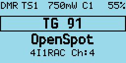

#### Manual TalkGroup number entry<!-- linebreak -->

- Press the **Hash** (**#**) key to enter an *ad hoc* TalkGroup number, followed by the **Green** key to confirm.

If the entered **TG** is in the *Digital Contacts*, the name of the **TG Contact** will be displayed, otherwise the number will be displayed *e.g.* **TG 98977**.

- To return to the previous *TG* prior to manually entering the TG, press either the **Left** or **Right** arrows keys.

When a *TG* has been **manually entered**, the display shows a **1 pixel box** around the TG display area to indicate that this TG has been manually entered, even if the *Contact / TG name* is displayed rather than the TG number.

#### Private Call number entry<!-- linebreak -->

- Press the **Hash** (**#**) two times to enter a Private Call DMR ID number.

In all numeric entry screens, pressing the **Red** menu key exits back to the previous screen, either the VFO or Channel screen.

#### Digital Contact selection<!-- linebreak -->

- Press the **Hash** (**#**) three times to access the Digital contacts defined in the CPS.

The contact name is shown in the middle of the screen, *e.g.* “**TG 505 TS2**” and the *TalkGroup* or *PC* number is shown in smaller text at the bottom of the screen.

- Press the **Up** or **Down**  arrows to cycle through the list of *Digital Contacts*.
- Press **Green** to select or **Red** to cancel.

Private calls can also be selected in this manner.

#### Station DMR ID number entry<!-- linebreak -->

- In **Contact selection mode**, press **Function** + **Hash** (**#**) key, and an *alternative* **DMR ID** can be entered for the radio (*for test purposes*) to temporarily override your normal DMR ID number which was loaded from the codeplug.

This DMR ID will be used for transmission **until** the radio is rebooted or you enter another DMR ID via the same screen.

To make the change permanent, so that it is written to the codeplug memory, Press **Function** + **Green** instead of **Green** to confirm the number.

### FM specific functionality (*VFO and Channel screens*)

#### FM and FM Narrow<!-- linebreak -->

For FM with **25kHz bandwidth** with the text “**FM**” is displayed in the top left of the screen. For narrow band width **12.5kHz bandwidth** the text “**FMN**” is displayed.

#### CTCSS Tone or DCS Code<!-- linebreak -->

These can be set for the Channel or VFO. The letters **C** or **D** and **T**, **R**, or **TR** will be displayed next to the FM indicator at the top of the screen.

**C** means CTCSS and **D** means DCS code. **T** means Tx tone or code only. **R** means RX tone or code only. **TR** means both Tx and Rx tones or codes are configured.

It is possible to configure Tx and Rx tones or codes independently.

#### Squelch<!-- linebreak -->

- Pressing **Left** or **Right** keys, controls the FM squelch.

Once in squelch control mode, pressing **Right** tightens the squelch incrementally, **Left** opens up the squelch incrementally. The VFO and each channel have individual squelch settings that can be set in this manner.

The variable squelch can be set to different values for each Channel and for the VFO using a new feature in the CPS, where the squelch can be set anywhere between **Open** and **Closed** in **5% steps**.

In this example the squelch in the VFO is set to 20%.

If the squelch is changed in the VFO the value will be remembered even if the radio is power cycled. However if the squelch on a channel is changed, the value is only a temporary override.

To make the squelch change permanent to a Channel, press **Function** + **Green** to enter the *Channel Details* screen, and then press **Function** + **Green** again to save the channel data to the codeplug.

*Note:*

- If Rx CTCSS is enabled, this has priority over the squelch control, and lowering the squelch threshold will not cause the squelch to be opened.

#### 1750Hz Tone for repeater operation<!-- linebreak -->

- Pressing the **Function** button during FM transmission, sends the 1750Hz tone required for some repeater operation.

#### DTMF tone transmission<!-- linebreak -->

- Pressing any key (except the **Green** and **Red** menu keys) on the keypad during transmission will transmit the DTMF tones for that key.

The tone will also be audible through the speaker.

### VFO specific functionality

The VFO displays both the TX and RX frequency at all times.

When the currently selected frequency is the **RX** frequency, an arrow (**\>**) is displayed to the left of the “**R**”, changes to the frequency will adjust both the TX and RX frequencies.

#### Frequency change up/down step<!-- linebreak -->

- Pressing the **Up** or **Down** arrows will change frequency by the value defined in the frequency step value defined for the VFO in the CPS.

The step can be adjusted by pressing **Function** + **Green** to enter the Channel Details mode, and then adjusting the “**Step**” setting

#### Numerical frequency entry<!-- linebreak -->

- Pressing **any of the number keys** allows the direct entry of the frequency.

When all digits have been entered, the accept beep tones are played, and the display returns to the VFO screen.

If an invalid frequency is entered the error beep tones are played.

When entering a frequency:

- Pressing the **Red** key cancels the entry.
- Pressing the **Left** arrow deletes the digits one by one.

#### To adjust the TX frequency, independent of the RX frequency<!-- linebreak -->

- Press and hold **Function** button on the side of the radio, and then the **Down** arrow.

This will change the currently selected frequency to the TX frequency, and the arrow will move to the left of the “**T**” instead of the “**R**”

To change the RX frequency again, press **Function** + **Up** arrow.

When the TX frequency is changed, the RX frequency will not be changed.

Use this method to set different TX and RX frequencies. For example, this can be useful for satellite operation as it allows **Cross Band** operation as well as **Split** frequency simplex operation on the same band.

*Note:*

- If different TX and RX frequencies are set, and the currently selected input is set to RX, changing the RX frequency will also change the TX frequency, and the difference between the RX and TX frequency will be maintained if possible.

The only case where the frequency difference **will not be maintained** is if the TX frequency goes outside of the range of frequencies supported by the radio hardware.

## Monitor mode

Monitor mode enables the operator to listen to a signal even if it is currently being filtered by either the **DMR TG**, **TS** or **CC** filters or the **FM CTCSS / DCS** filter or **FM squelch** level setting.

- To enable Monitor mode press and hold button **Function** button (which is the **SK2** button on the GD-77).

After 2 seconds the radio will enter monitor mode, and stay in this mode until the **Function** is released.

When Monitor mode is active:

- In **FM mode**: any Rx **CTCSS / DCS** filter is disabled, and the squelch is changed to be fully open.
- In **DMR mode**: the **TG**, **TS** and **CC** filters are disabled, and if **no DMR signal is detected within 250mS** the radio is switched to FM mode with the CTCSS / DCS and squelch disabled.

Releasing the **Function** button returns the radio back into the mode and filter configuration prior to it being pressed.

## Transmitting

During transmission the *Talk Timer* either counts up or down, depending on whether the channel has a timeout defined.

If a timeout is defined in the CPS, or adjusted in the *Channel Details* screen, the *Talk Timer* will count down and when the timeout period is reached a beep will play and the TX will stop.

When transmitting to a DMR repeater which is not currently transmitting, the timer will not start counting until the repeater becomes active.

During FM and DMR Tx, a *VU meter* is displayed showing the input microphone level, in the form of a bar graph across the top of the screen.

### Timeout warning beep

A timeout warning can be configured in the **Sound Options** menu. The radio will beep every 5 seconds when the remaining call time is less than the timeout.

### TOT

If **TOT** is setup for the current Channel or VFO, when the timer counts down to zero the transmission will stop, a warning beep will be played and the radio will stop transmitting.

## Scanning

Both the Channel and VFO screens support scanning, but their operation is slightly different.

### Channel scanning

- Press and hold (**Long press**) the **Up** arrow to start scanning the channels in the zone.
- Press the **Left** arrow to reverse the direction of scan.
- Press the **Right** arrow to mark the channel as a *nuisance* channel which will be removed from the current scan.
- Press the **Up** arrow to skip over the current channel, and continue the scan.

Pressing any other button stops the scan.

Whilst scanning, the mode indicator **DMR** or **FM** will flash.

### VFO scanning

The VFO screen has a special scanning mode, which is entered by performing a **Long Press** on the **Up** arrow button.

When scan mode is enabled, the display changes to show the *lower* and *upper* scan limit frequencies, instead of showing the Tx frequency.

Initially the scan limits will be set to the current VFO Rx frequency to the current VFO Rx frequency plus 1Mhz.

Scan limits can be changed by manually entering both frequencies *e.g.*

**1 4 4 0 0 0 1 4 8 0 0 0**

- To start the scan, use Long press on the **Up** arrow, until the radio beeps.

When not actively scanning, pressing the **Up** or **Down** arrows performs the normal function in the VFO of increasing or decreasing the frequency.

- Press the **Left** arrow key to reverse the scan direction.
- Press the **Up** arrow to skip over the current frequency and continue the scan.
- Press the **Right** arrow to mark the current frequency as a *nuisance* frequency, which will be omitted by the scan.

Pressing any other button will stop the scan

- Long press on the **Down arrow** arrow exits from scan mode.

## Other screens

### Lock screen

To lock the keypad.

On either the VFO or the Channel screen, press the **Green** menu key to display the **Main menu**, then press the **Star** key. Pressing the **Star** key from any top-level item within the Main menu locks the keypad.

- To unlock the keypad, press and hold the **Function** button and press the **Star** key.

You can also lock the **PTT** button by pressing the **Green** menu key to display the Main menu and then pressing the **Hash** (**#**) key. The keypad **and** the **PTT** can both be locked at the same time by first locking the **PTT** and then the keypad.

### Text entry

The firmware now supports alphanumeric text entry while creating a new contact or editing an existing one.

- Press **Left** and **Right** to move the cursor.
- Press **Function** + **Left** to backspace, and **Function** + **Right** to insert a space.

The keypad entry follows the same functionality as stock GD77 firmware.

## The control keys and buttons

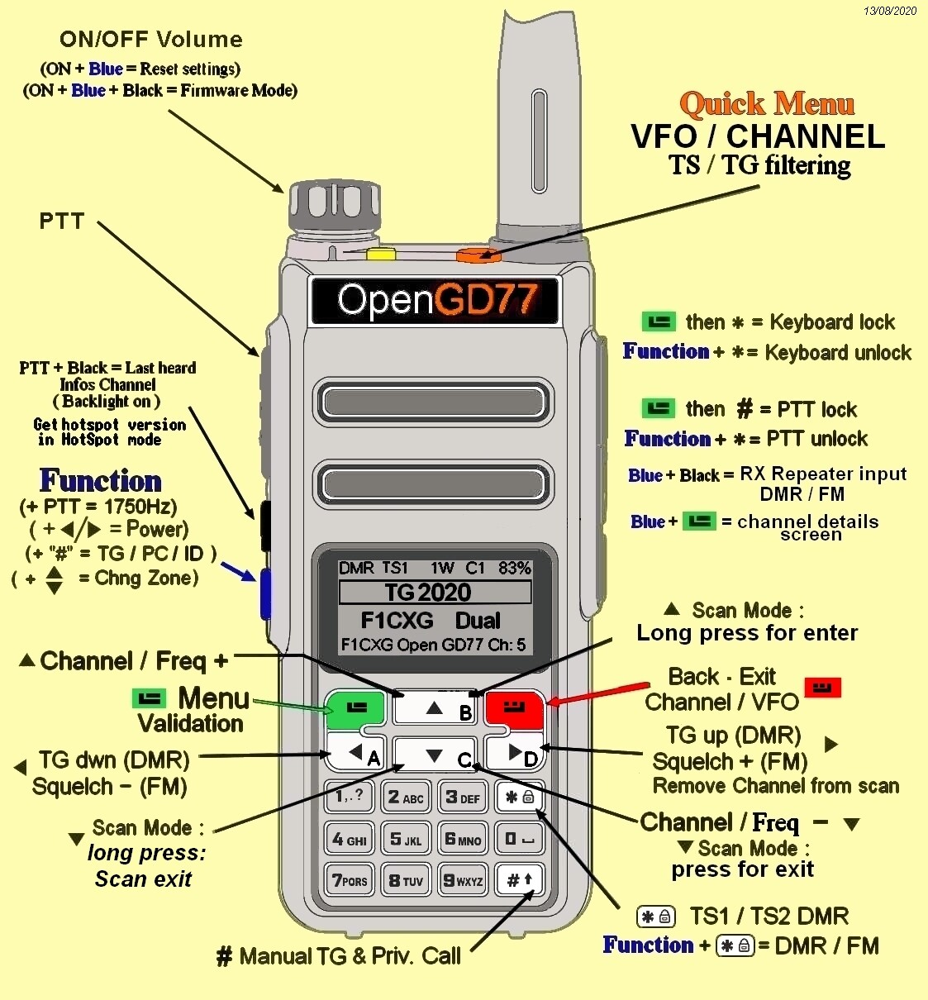<!-- { width=600 } -->

<!-- { width=600 } -->

## The Menu System

The **OpenGD77** firmware utilizes a significantly revised menu structure compared to the official firmware.

Targeted at amateur use, this focuses on being more straightforward, with highlight on commonly-used features.

Please refer to the menu map below.

- Pressing the **Green** key enters the menu system, press again to enter a menu subsection or to exit the menu.
- Press the **Red** key to step back one level or to exit the menu system.
- The **Up** and **Down** arrow keys step up and down through the various pages of the menu system.
- The **Left** and **Right** arrow keys will change the individual items in the menu system where they are changeable.
- The **Blue** button on the side of the radio, known as **SK2**, is used as a **Function** key. Various features are accessed by holding the **Function** key when pressing a button on the keypad.
- Press the **Orange** button to access the quick menu from the standby screen.

## Main Menu

### Zone

This menu is used to select which groups of Channels, called a **Zone**, is used in the *Channel screen*, and operates in the same way as the official Radioddity firmware, except with one addition.

In addition to the Zones that are defined in the CPS and uploaded to the radio using the CPS, the firmware creates a special Zone called **All Channels**.

When the *All Channels* zone is selected, the Channel screen displays **All Channels** and the channel number instead of the Zone name and Channel number.

- Pressing the **Up** and **Down** arrows will cycle through all channels in the zone.
- Pressing any of the number keys on the keypad, enters **Goto** *channel number* mode.

In this mode, you can enter multiple digits and then press the **Green** key to confirm, or the **Red** key to cancel.

Note that you can quickly cycle through zones by holding the **Blue** button and pressing **Up** or **Down** in *Channel mode*.

### RSSI

Displays a signal strength indicator showing the numerical **RSSI** value in **dBm**, along with an *S-Unit bar graph*.

*Notes:* 

1. The S meter scale used, has been suggested by Jason VK7ZJA and does not confirm to the ITU standard for dBm per S unit, for values below S9.
The ITU standard for S9 is -93dBm, which is what the RSSI screen uses.
However, the ITU standard uses 6dBm intervals per S unit, which results in the S1 value, being a long way below the noise floor on any of the supported radios.
So the firmware uses 4dBm per S unit. 
It is common practice for Ham radios not not follow the ITU S meter units precisely, with common values of dBm per S unit being between between 4dBm and 6dBm per S unit.

2. Because of the small display on the supported radios, the scale of the RSSI bar is different below S9 to above S9, to provide greater resolution and readability of values from S0 to S9. 
The physical scale from S0 to S9 is twice the size of the value above S9.

3. The maximum RSSI value when the radio is configured to receive DMR is approximately S9+10dB, however on FM the maximum RSSI value is approximately S9+60dB.
So the scale above S9 changes depending on the radio mode, so the full scale is the maximum signal strength that can be recieved in that mode.

4. The RSSI value from the hardware (AT1846S RF chip), is not calibrated and varies by around +/- 1.5dBm between individual radios.

### Radio Info

Displays the current battery voltage and percentage, battery voltage history and radio temperature.

- Press the **Down** key to display the radio temperature.

- Press the **Down** key to display the battery usage chart. This shows the history of battery voltage on an hourly basis.

- Press the **Left** or **Right** to alternate from fill to line style.

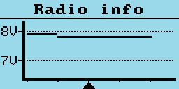

### Last Heard

Displays a record of the last 32 DMR stations that the radio has received.

- Pressing the **Up** or **Down** arrows cycles through the list to show stations which have been heard.
- Pressing the **Green** key will set the selected station DMR ID as the new PC / TG contact.
- Hold **Blue** button to view details like TalkGroup and time elapsed

### Firmware Info

Displays the date and time the firmware was built, and also the Github commit code in brackets.

To view details on Github, append the code to <https://github.com/rogerclarkmelbourne/OpenGD77/commit/>

*e.g.* <https://github.com/rogerclarkmelbourne/OpenGD77/commit/a0ebbc7>

### Options

This menu controls various settings specific to the firmware

#### Band Limits<!-- linebreak -->

This setting controls the frequency band ranges inside which the radio can transmit.

Options are 

- ***OFF***: where transmission is **not limited** to band ranges.
- ***ON***: where the **band limits for the USA** are applied (**this is the Default setting**):
  - 144MHz - 148MHz,
  - 222MHz - 225MHz,
  - 420MHz - 450MHz.
- ***CPS***: where the VHF and UHF limits set **in the CPS** are used. If the CPS band limits do not contain valid values, for example the UHF frequency band range is **less than** or **intersects** with the VHF band range, the radio will use the **Default** settings (as above)

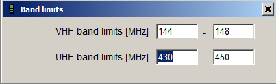

The CPS band limits **do not affect** the overall hardware band limits, hence it **is not possible** to extend the hardware limits by using values for the CPS band limits which extend outside the hardware limits.

The hardware band limits are:

- 127MHz - 178MHz,
- 190MHz - 282MHz,
- 380MHz - 564MHz.

These limits are because the *AT1846S RF* chip **will not operate reliably** outside this range, and this range is actually beyond the published specification of the AT1846S, which is technically 134MHz - 174MHz, 200MHz - 260MHz, 400MHz - 520MHz.

It should also be noted that the radio does **not** have a PA or Rx section for the 200MHz band, **so operating in this range has high spurious emissions, usually on the 1st harmonic of the frequency in use**.

#### Key long<!-- linebreak -->

This setting controls the time (*in seconds*) after which a key is considered to be a long/repetitive press.

#### Key rpt<!-- linebreak -->

This setting controls the speed of key repetitions when a key is held.

#### Filter time<!-- linebreak -->

This feature works when *TimeSlot* filtering is turned **off** (**Filter: Off** in the *Quick Menu*).

It sets the duration the radio listens in to one particular *TimeSlot* before resuming listening to the other *TimeSlot* for traffic.

This prevents the radio from switching to the other *TimeSlot* in the event that there is a long pause or transmission gap in the current *TimeSlot* being heard.

When **TimeSlot** filtering is turned **on** (**Filter: TS** in *Quick Menu*), this does not have any effect.

#### Scan delay<!-- linebreak -->

During scan mode, this controls the duration that the radio tunes in to a channel before resuming scan.

This works when **Pause** is selected as the scan mode.

#### Scan dwell<!-- linebreak -->

During scan mode, this controls the duration that the radio listens (dwells) on each frequency. This applies to both channel mode and VFO mode scanning. The default value is 30ms. Longer dwell times result in better sensitivity to weak signals, but slower overall scan speed.  For DMR simplex channels the dwell time duing the scan will be set to 60ms even if the dwell time is set to less than 60ms, because its necessary to listen for at least 60ms in order to receive at least 1 DMR frame / timeslot.

#### Scan mode<!-- linebreak -->

This setting controls how the receiver stops when there is a signal during scan mode.

- **Hold**: continuously tunes in to a channel when a signal is received.
- **Pause**: tunes in to that signal for a specified duration (*Scan Delay*) and then resumes scan.
- **Stop**: the scan mode will exit on the first valid received signal.

#### Squelch UHF<!-- linebreak -->

This setting controls the squelch level for **70cm UHF** when using an analog Channel or during analog mode in VFO. **Default is 45%**.

#### Squelch 220<!-- linebreak -->

This setting controls the squelch level for **220MHz** when using an analog channel or during analog mode in VFO. **Default is 45%**.

#### Squelch VHF<!-- linebreak -->

This setting controls the squelch level for **2m VHF** when using an analog channel or during analog mode in VFO. **Default is 45%**.

#### PTT Latch<!-- linebreak -->

When **PTT latch** is enabled, the **PTT** switch toggles the radio to transmit or receive. In this mode the PTT does not need to be pressed continuously during an over.

*Note:*

- The PTT latch function **only works** if a timeout has been defined for the Channel or VFO, to prevent constant accidental transmission.

#### Hotspot<!-- linebreak -->

**Hotspot mode is not supported on the Baofeng RD-5R / DM-5R because the hardware does not support reliable USB communications while the radio is transmitting**

This option controls whether the firmware will enter hotspot mode when connected to MMDVMHost, including Pi-Star, or to BlueDV.

Options are

- **Off**
- **MMDVM**: for use with Pi-Star or any other system using MMDVMHost.
- **BlueDV**: for use with BlueDV.

On the GD-77S. To enable hotspot mode, Press and hold the **SK1** (**Black**) button while turning on the radio. This will toggle hotspot mode between **MMDVM** and **BlueDV** mode.

#### TA Tx<!-- linebreak -->

Enables **transmission** of *Talker Alias* data.

*Note:*

- Talker Alias reception is always operational. Do not enable this feature because you are not receiving TA data, as it does not control TA Rx.

The text of **Line1** and **Line2** from the "**Boot Item**" CPS screen is used for this transmission, with no space between the **Line1** and **Line2** data.

*Note:*

- Use of this feature **will cause problems on Motorola based repeaters and networks**, and should only be used for simplex and possibly on *Brandmeister* and other networks which correctly support Talker Alias.

#### Allow PC<!-- linebreak -->

Allows **Private Calls** to be received.

#### User Power<!-- linebreak -->

Allows the operator to set the hardware PA drive level to any value between 0 and the maximum (4100)

The transmit power produced by this setting will vary depending on the band, and also individual radio performance.

Power output on VHF is much higher than it is on UHF for the same PA drive value.

To use the User Power value, the power setting much be set to the +W- option. See the "Controlling PA power" section.

#### Temp Cal<!-- linebreak -->
Temperature sensor calibraton

The microcontroller (CPU) in radio contains an internal temperature sensor, which measures the temperature of the microcontroller.
The temperature is displayed on the temperature page of the Radio Info screen.
The temperature sensor value needs to be calibrated before it is at all accurate, and this setting allows the operator to set an offset value, so that the sensor reads correctly for their radio.
It should be noted that this is the temperature of the microcontroller and not the PA or the battery.

#### Bat Cal<!-- linebreak -->
Battery voltage calibration

The radio contains a circuit which measures the voltage of the battery, however because of hardware design errors and tolerances in external components, the value measured by the microcontroller may not be accurate.
This setting allows the operator to correct for the component tollerances and hardware design.

#### Eco Level<!-- linebreak -->

Controls the power saving when the radio is idle, (when the radio is receiving but there is no signal.)

Level 0: No power saving measures are used. 

For other values refer to the table below

Level | Rx duty cycle | Entry delay (secs) | Average latency (ms) | Current (mA)
----- | ------------- | ------------------ | -------------------  | ------------
0  | N/A  | N/A | N/A | 62
1  | 1:1  | 10 | 240  | 40
2  | 1:2  | 8  | 330  | 33
3  | 1:4  | 6  | 500  | 27
4  | 1:8  | 4  | 810  | 23
5  | 1:16 | 4  | 1360 | 21

Default is level 1.

Level 2,3,4 and 5 power down the C6000 DMR chip, which can cause problems with DMR and beep audio on some radios.

This is caused by an internal bug in the C6000 chip. If your radio has problem with DMR or beep audio on level 2 and above, please use Level 0 or Level 1.

Current was measured on a GD-77 with a full battery, with in Rx with no signal, and no backlight.

Current consumption increases as battery voltage descreases because of the switching regulators used in these radios.

Average Rx idle power consumption of the GD-77 is 500mW.

### Display Options

#### Brightness<!-- linebreak -->

The firmware allows the display backlight brightness to be controlled from **100%** to **0%**, in **10% steps** between *10%* and *100%*, and below *10%* the brightness is controlled in **1% steps**.

- Use the **Right** and **Left** arrow keys to adjust the brightness.

The default backlight brightness (**default 100%**).

#### Min Bright<!-- linebreak -->

Controls the display backlight brightness in it’s "*Off*" state.

The default value is **0%**, so that when the display is in its **Off** state, there will be no backlight.

#### Contrast<!-- linebreak -->

The firmware allows the display contrast to be set.

Lower values result in dark text, higher values result in darker text but the background also starts to become dark at higher settings.

#### Display mode<!-- linebreak -->

Controls the display backlight operation

- **Auto** The backlight will turn on automatically when triggered by various events *e.g.* Rx of signal, or pressing a key or button.
- **Squelch** The backlight remains illuminated while the FM squelch is open or there is a valid DMR signal, and also remains illuminated for the specified backlight timeout after the squelch has closed. The minimum timeout period in this mode is 5 seconds.
- **Manual** The backlight is toggled on and off by pressing the **Black** button (**SK1**).
- **Buttons** The backlight will only illuminate if a button or key is pressed (including the PTT)
- **None** The backlight will not illuminate under any condition.

#### Timeout<!-- linebreak -->

Sets the time before the display backlight is extinguished (**default No timeout**).

Setting this value to "**No**" prevents the backlight from turning off at all.

#### Colour mode<!-- linebreak -->

This option allows for Normal or inverse colour display.

- **Normal** is white background with black pixels
- **Inverse** is black background with white pixels.

*Note:*

- This does not completely replicate the GD-77 “*Black*” display hardware version, because that radio uses a different LCD panel which physically has a black background, whereas the normal GD-77 has an LCD panel with a white background.

#### Order<!-- linebreak -->

Controls where the DMR Contact display data is sourced from:

- **Ct**: Digital Contacts (*in the codeplug*).
- **Db**: DMR ID database.
- **TA**: Talker Alias.

The default is **Ct/Db/TA**, which means the received DMR ID is first checked in the **Digital Contacts**, and if not found the **internal DMR ID database** is searched, and if not found and the DMR transmission includes **Talker Alias**, then Talker Alias will be used.

#### Contact<!-- linebreak -->

Controls the position on the screen where the DMR Callsign and Name etc, is displayed.

Options are

- **1 Line**: This only uses the middle line of the display to show the callsign and name. When using **Talker Alias** which contains more characters than the 16 character width of the screen, the text will be cropped, so **you will not see the end of the TA text**.
- **2 Lines**: The Callsign is displayed on the middle line of the display, and the name and other information will be displayed on the bottom line of the display. *i.e.* the firmware automatically breaks up the "**CALLSIGN NAME**" format text at the space separating the **CALLSIGN** from the **NAME**.
- **Auto**: When the Callsign and Name will fit on the middle line of the display, only the middle line will be used (this is equivalent to the "1 Line" option.). If the caller information, *e.g.* from TA, is longer than 16 characters and won't fit on the middle line, the display will be split onto both lines and is equivalent to the "2 Lines" option.

The default is **1 Line**.

#### Battery units<!-- linebreak -->
Controls whether the battery is show as a percentage or as voltage.

Options are

- **%**:  Shows the battery percentage *e.g.* **0%** to **100%**.
- **V**:  Shows the battery voltage *e.g.* **8.1V**.

#### Info<!-- linebreak -->

Controls whether the Timeslot or Power level is displayed in bold to indicate that an override is currently applied to that setting

Options are

- **Off**:  Neither the TS or Power is shown in bold to indicate an override
- **TS**:   The TS is shown (in bold) as **TS*x*** or **cS*x*** if the TS has been overridden by either pressing the * (Star) key, or by a TS override on a Contact / TG (displayed as cS*x* in this case)
- **Pwr**:  The Power is shown in bold if a channel specific power setting is currently being applied which overrides the master power setting
- **Both**: Equivalent to both the TS and Pwr options as described above.

#### Leds<!-- linebreak -->

Controls whether the red / green (tx / rx signal) LED illuminates 

Options are 

- **On**: The LED(s) will illuminate as normal e.g. Red LED will illuminate when transmitting, Green LED will illuminate when there is a signal
- **Off**: The LED(s) will not illuminate

### Sound Options

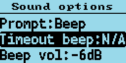

#### Timeout beep<!-- linebreak -->

This setting controls whether the radio emits timeout warning beeps during transmission when the timeout is about to expire and transmission will be terminated.

#### Beep volume<!-- linebreak -->

This controls the volume of the beep and other tones, and can be set from **100%** to **10%** in these increments: (**-24dB**, **-21dB**, **-18dB**, **-15dB**, **-12dB**, **-9dB**, **-6dB**, **-3dB**, **0dB**, **3dB**, **6dB**).

#### DMR Beep<!-- linebreak -->

This setting controls the beeps which are played at the **start** or **end**, or **both** start and end of DMR transmissions.

The beep at the start of transmissions is used to confirm connection to a repeater, because it is only played when the radio enters the main transmission phase to a repeater, and not when its '**waking**' the repeater.

These beeps are only played through the radio's speaker, they are not transmitted via the DMR audio signal.

Options are:

- **None**
- **Start**
- **Stop**
- **Both**

#### DMR mic<!-- linebreak -->

This controls the audio gain of the DMR microphone input system, relative to the default value.

This only adjusts the gain on DMR, and does not affect the FM mic gain.

Settings are in **3dB steps**, with **0dB being the normal default setting**, which is the same as the official firmware.

#### FM mic<!-- linebreak -->

This controls the audio gain of the FM microphone input system, **relative to the default value**.

- Positive values result in more gain than default,
- Negative values result in less gain than default.

The units of this control in the baseband IC (*AT1846S*) **are not known**.

#### VOX threshold<!-- linebreak -->

Threshold value which controls the mic level which **triggers** the radio to transmit when VOX is enabled.

#### VOX Tail<!-- linebreak -->

Controls the length of time **after** the operator stops speaking, before the transmission is ended.

#### Prompt<!-- linebreak -->

This setting controls the **audible feedback** to button and key presses etc and has the following options:

- **Silent**: The radio does not provide any audio feedback to button 
- **Beep**: The radio emits a beep when keys or buttons are pressed. There are 2 different pitches of beep.

    When navigating through *Channels* or *Talkgroups* or *menu items*, when the first item in the list is reached the **higher pitch** beep is emitted.
	
    Also when switching between *Timeslots*, the **higher pitch** beep is emitted on **TS1**.
	
    When **switching between FM and DMR** mode the **higher pitch** beep is emitted when the mode is **DMR**.
	
    When changing power, the **higher pitch** beep is emitted when the **lowest power level is selected**.

- In addition to the beep, the firmware also supports voice prompts **if a voice prompt file is loaded via the CPS**.
  There are 3 levels of voice prompt,
  - "**Voice**",
  - "**Voice L2**" and
  - "**Voice L3**", in the latter two cases the L indicates the "Level"

  The voice level is used to control whether the voice prompt is played immediately, or whether the operator needs to press button SK1 to play the prompt which describes the last change made to the radio.

  For example. On **Voice** mode, which is **level 1**, the things which are voiced immediately voiced are:

  - Number key, and # key buttons being pressed.
  - Changes to squelch level.
  - Menu options are announced as you arrow through the menu system, as well as the "*Quick*" menus accessed via the Orange button on the top of the radio.
  - Option values are announced as you change menu settings.

  Voice **level 2** has almost identical operation to Voice **level 1**, except that if a key or button is pressed while a prompt is already being played, **there will be a slight reduction in the verbosity of the next response**.

  Voice **level 3**, all items voice **immediately**, including:
  - Channel names are announced as you arrow through channels in channel mode;
  - Talkgroup names are announced as you arrow through them in DMR mode;

  Voice prompts can be **re-announced** by pressing the **SK1** button.
  
  For example, if the last voice prompt was the *Talkgroup name*, then pressing **SK1** will play the **Talkgroup name again**.

  Pressing **SK1** whilst a voice prompt is playing, **terminates the voice prompt playback**.

### Channel Details

#### Mode<!-- linebreak -->

*FM* or *DMR*.

#### Color Code<!-- linebreak -->

Sets the *Color Code* when the VFO / Channel is set to **DMR**.

#### Timeslot<!-- linebreak -->

Selects DMR *Timeslot* 1 or 2 when the VFO / Channel is set to **DMR**.

#### Tx/RX Grp<!-- linebreak -->

Selects which *Tx / Rx group* is assigned to the current channel (**DMR only**).

#### Tx CTCSS or DCS<!-- linebreak -->

Sets the *transmit CTCSS tone or DCS code* when the VFO / Channel is set to **FM**.

#### Rx CTCSS or DCS<!-- linebreak -->

Sets the *receive CTCSS tone or DCS code* when the VFO / Channel is set to **FM**.

For both Tx and Rx CTCSS / DCS.
- **Long press**, **Right** or **Left** arrows, skips forward, or back by 5 entries in the list of possible CTCSS / DCS settings.
- Pressing **Function** + **Right** or **Function** + **Left** skips to the end or beginning of the current CTCSS / DCS items.

#### Bandwidth<!-- linebreak -->

Sets the *Rx and Tx bandwidth* in **FM** mode to either **25Khz** or **12.5Khz**.

#### RX<!-- linebreak -->

Rx frequency.

Enter the frequency via the keypad.

#### TX<!-- linebreak -->

Tx frequency.

Enter the frequency via the keypad.

#### Step<!-- linebreak -->

Selects the VFO / Channel frequency step size.

#### TOT<!-- linebreak -->

Sets the time out timer to **OFF** or **ON**.

#### Zone Skip<!-- linebreak -->

Set to *skip the Channel* when scanning within the *zone*.

#### All Skip<!-- linebreak -->

Set to *skip the channel* when scanning within the **All Channels** zone.

#### VOX<!-- linebreak -->

Controls whether VOX (Voice Operated Switch) is enabled or disabled.

#### Ch Power<!-- linebreak -->

Controls the custom / individual power assigned to the channel.

See also the section in about controlling power.

**By default**, all channels will use the **Master** power setting, and this option allows a **custom** power setting to be set on a channel, or for the channel set to use the **Master** power setting.

#### Accepting and saving the changes to the channel<!-- linebreak -->

- Pressing the **Green** menu key confirms the changes.
- Pressing **Function** + **Green** saves the settings to the codeplug, or in the case of the VFO the changes are saved to the non-volatile settings.
- Pressing the **Red** menu key closes the menu without making any changes to the channel.

### Credits Screen

Details of the creators of firmware.

If other developers contribute to the development effort they will be added to this screen, and the addition details will be viewed by pressing the **Down** arrow to scroll the text.

## User definable number key functionality QuickKeys

The number keys  0 - 9 can be defined by the operator to perform many functions available in the menu system, including opening specific menu screens, or adjusting individual settings e.g. increase display backlight brightness

To define a QuickKey navigate to a Menu, or menu screen, and press SK2 + NUMBER (0 to 9). 
If the radio is displaying the main Menu the key will be assigned to open the screen for the currently selected menu item.
If the radio is on a screen like Last Heard, then the key will be assigned to open that screen.
If the radio is on a screen with sub-options e.g. the Display Options screen, then the operator will be prompted to specify whether the QuickKey should action the Left or Right arrow or the Green menu / OK.
If Left or Right is selected e.g. to increase or decrease a value, this will be the function of that QuickKey e.g. Increase display backlight brightness.
Selecting OK, will assign the QuickKey to open the menu to the selected option, but will not change it.

After a QuickKey has been saved, the radio will beep to acknowledge the action has been saved.

To play a QuickKey, the radio must be on the Channel or VFO screen, and is actioned by pressing the same key combination SK2 + Number

A QuickKey can be cleared by doing a Long press of SK2 + NUMBER (0 - 9). The radio will beep with descending followed by ascending beep to confirm the QuickKey combination has been cleared.

If a QuickKey has been asssigned to a function, it can't be re-assigned to another function until it has been cleared.

## Making and receiving DMR Private Calls

### To make a Private Call

In DMR mode, either in the VFO or the Channel screen:

- Press the **#** key twice to enter the *Private Call DMR ID*
- The top of the screen will now show “**PC entry**”
- Enter the station’s DMR ID *e.g.* **5053238**
- Press the **Green** menu key to confirm, or the **Red** menu key to exit.

*Note:*

- If you make a mistake when entering the number, press the **Left** arrow key to erase the digits one by one.
- If the PC ID you entered is in the DMR ID database you had previously uploaded to the radio, the station Callsign and name will now be displayed on the screen.
- If the ID is not in the DMR ID database, the text, “**ID:**“ followed by the number, will be displayed

**The radio is now in Private call mode.**

To return to normal Talkgroup operation, there are 3 methods:

1. Press **Function** + **Red** menu key.
2. Press the **Left** or **Right** arrow key which will load the next TG in the Rx Group list assigned to the VFO or the Channel.
3. Press the **Hash** (**#**) key, then enter a TG number and press the **Green** menu key..

*Note:*

- When in *Private Call* mode, changing between VFO mode and Channel mode or vice versa, via the **Red** menu key will not change back to *TalkGroup* mode.

### To Receive a Private Call<!-- linebreak -->

On receipt of a *Private Call*, the radio will display this screen:

With the caller's *Callsign* and *Name* (or ID) displayed.

To accept the call, and configure the radio to return the Private call back to the calling station:

- Press the **Green** menu key, for YES. 
- Otherwise either press the **Red** menu key for No, or ignore the prompt and continue using the radio as normal.

If you accept the Private Call, the radio will be switched into **Private Call mode**, ready for transmission.

The caller's ID or Name is shown *e.g.*:

Once the Private Call is complete, you can return to the *Talkgroup* you were on prior to accepting the Private Call, by pressing **Function** + **Red** menu key. (or by any of the methods described in the section on making a **Private Call**).

## Hotspot mode

**IMPORTANT INFORMATION**

**Hotspot mode is not supported on the Baofeng RD-5R / DM-5R because the hardware does not support reliable USB communications while the radio is transmitting**

- The USB connection between the radio and the host system *e.g.* Pi-Star **needs to be protected from RF injection**, otherwise the USB connection will **occasionally be reset** when the radio is transmitting, which will cause the hotspot to **stop working**.
- **Do not use the antenna on top of the radio** when in hotspot mode, this usually causes RF injection problems which **can't** be resolved by screening or ferrite chokes.
- Connect the radio to an **external antenna**.
- Use **ferrite** RFI protection on the USB cable.
- When using a Raspberry Pi as the host system, use a **metal enclosure** for the Raspberry Pi.

The firmware can operate as a DMR (**voice only**) hotspot when connected via its USB programming cable to a Raspberry Pi running Pi-Star, or *any other device* that is running MMDVMHost.

*Note:*

- Hotspot mode may be compatible with software like **BlueDV**, but your mileage may vary.

First, connect the radio to a Raspberry Pi via its programming cable.

<!-- { width=600 } -->

Hotspot mode works with the Raspberry Pi Zero, but an adaptor cable is needed to convert from the micro USB port on the RPi Zero to the full size USB plug on the radio's programming cable.

In the Pi-Star Configuration screen, select “**OpenGD77 DMR hotspot (USB)**” as the modem type.

If your version of Pi-Star does not contain the OpenGD77 DMR Hotspot as an option, please **update** your version of Pi-Star.

Assuming the modem type has been set properly in Pi-Star, the display will change on the radio to show it is in **Hotspot Mode**, and will show the *Color Code*, *Receive frequency* and approximate *TX power* in mW.

If the radio still fails to enter hotspot mode, check your USB connections.

*Note:*

- By default Pi-Star configures the “modem” to have a power setting of “100” in the Expert -> MMDVMHost settings.

This is 100% of the maximum power of the modem, and in the case of the radio the maximum power output is **5W**, but the radio is not designed to operate as a hotspot, where it may be continuously transmitting.

The maximum power setting that the radio can support for continuous transmission will vary depending on the operating environment, including the ambient temperature and antenna SWR, etc.

It is the responsibility of the user to set an appropriate power level that will not overheat and damage the PA.

In Hotspot mode, if Pi-Star (MMDVMHost) sends a power setting of 100%, the assumption is that that Pi-Star has not been correctly configured for the OpenGD77 and this value is disregarded.

Instead the firmware will use the current (Channel or VFO) power setting, which will default to 1W.

If the power setting in the Pi-Star MMDVMHost Expert settings is any other value *e.g.* **50%**, the hotspot will use that power setting closest to the chosen value.
So **50%** of *5W* is **2.5W**, and the closest power setting to this is *2W*.

Power | Pi-Star RFLevel
--- | ---
50mW  | 1
250mW  | 5
500mW  |10
750mW  |15
1W  |  20
2W  | 40
4W  | 80
5W  | 99
5W++ | N/A

The receive frequency specified by Pi-Star will be displayed at the bottom of the screen.

*Note:*

- Offsets **should not be applied** to the TX or RX frequencies in Pi-Star, because the radio should not need any offsets, and any offset will be reflected in the frequency displayed on the radio, because Pi-Star actually sends the master frequency +/- the offset to the hotspot.

When the radio receives an RF DMR signal, the green LED on the top of the radio will illuminate as normal, and the name and callsign are displayed if the DMR ID database contains that ID. If the ID is not in the DMR ID database, the ID number will be shown.

When Pi-Star receives traffic from the Internet and sends it to the hotspot for transmission, the hotspot displays the Callsign and name or the DMR ID, and the TX frequency is shown.

The LED on the top of the radio also turns red to indicate the radio is transmitting.

## Resetting the Settings

The radio can also be set to the default settings by holding the **Blue** (**SK2**) key while turning on the radio.

Additionally holding the **Blue** (**SK2**) button as well as the **Up AND Down** arrow keys , resets **any** custom boot melody and custom boot image that has been uploaded using the OpenGD77 CPS.

On the GD-77S, which does not have a keypad, holding **Blue** (**SK2**) **AND Orange** resets **any** custom boot melody.

If voice prompts are loaded into the radio, the Sound Options -> Prompt: setting will be set to Voice.
If voice prompts are not loaded the Prompt: will be set to Beep.

## GD-77S operation

To use the firmware with the GD-77S you **must** load voice prompt files using the OpenGD77 CPS. If you do not load voice files the radio will not announce anything, **and it will be virtually unusable**.

See the section relating to voice prompts and how to install them.

The GD-77S has a **16 positions** rotary switch on the top of the radio, next to the volume control.

This control is used to select the Channel in the current Zone.

*Note:*

- Although the OpenGD77 CPS and codeplug format allows up to 80 channels per Zone, the GD-77S can **only access the first 16 channels** in each Zone, so codeplugs designed for the GD-77 containing more than 16 channels will **need** to be modified so that each zone only contains a maximum of 16 channels.

The GD-77S has 2 buttons on the side of the radio below the **PTT** button. A **Black** button known as **SK1** and a **Function** button known as **SK2**. It also has an **Orange** coloured button at the top, next to the channel selector switch.

The firmware uses the concepts of different **Control modes**.

In each mode, buttons **SK1** and **SK2** perform a different function, the operator cycles through the **Control modes** by pressing the **Orange** button.

The **Control modes**, and the function of buttons **SK1** and **SK2** in each mode is as follows:

### GD77S Channel / TG mode

This mode is announced as "**Channel mode**".
In this mode, button **SK1** and **SK2** are used to cycle through the *Talkgroups* / *Contacts* assigned to the current channels

### GD77S Scan mode

This mode is similar to the Channel scan mode in the normal firmware.

Pressing **SK1** toggles scanning to **start** or **stop**, in the same way that holding the **Up** and **Down** arrows controls the Zone scan function in the normal firmware.

### GD77S Timeslot mode

In this mode, pressing either button **SK1** or **SK2** toggles from *Timeslot 1* to *Timeslot 2*.

### GD77S Color Code mode

In this mode, pressing **SK1** increases the *Color Code* number, and pressing **SK2** decreases the *Color Code* number.

### GD77S DMR Filter mode

In this mode, pressing **SK1** increases the *DMR filter level* and pressing **SK2** reduces the *filter level*.

See information in the normal firmware, in the VFO or Channel screen quick menu, for details for DMR filter levels.

### GD77S Zone mode

In this mode pressing **SK1** or **SK2** cycles through the *Zones*, pressing **SK1** selects the *next Zone* and pressing **SK2** selects the *previous Zone*.

Zone selection wraps around, so pressing **SK2** on the first Zone, selects the *last Zone*, and pressing **SK1** on the last Zone selects the 8first zone*.

### GD77S Power mode

In this mode, pressing **SK1** increases the power *by one step*, and pressing **SK2** decreases the power *by one step*.

See details of available power step levels in the normal firmware.

*Note:*

- Like in the normal firmware, the power output will only be accurate if the operator **has calibrated** the power of the radio, as the factory power level calibration is likely to be highly inaccurate.

## CPS software

*Note:*

- You **cannot** use the standard Radioddity CPS, or Baofeng CPS, to write to a radio flashed with the firmware.
If you wish to use the Radioddity CPS the radio will **need to run the official Radioddity firmware**. Once the codeplug has been written to the radio with your ID and callsign, you can then flash the firmware to the radio and it will then read and operate with the code plug written to it with the standard firmware and CPS software.

Please download the latest OpenGD77 CPS from here:
<https://github.com/rogerclarkmelbourne/OpenGD77CPS/releases>

Please see the next section for information specific to the OpenGD77 CPS. The information in the rest of this section is applicable to both the standard Radioddity CPS and the OpenGD77 CPS.

### Overview

The firmware simplifies the concept of TalkGroups, for maximum convenience for radio amateurs. Unlike most commercial DMR radios it is not necessary to create multiple channels to use the same frequency with many different transmit TalkGroups. Changing is as simple as scrolling **Left** and **Right** across your TalkGroup list or entering an *ad hoc* TalkGroup by pressing the **hash** key.

In DMR mode when using either the VFO or the Zones and Channels, you can use the LEFT/RIGHT arrow keys to scroll through and select any of the TalkGroups in the Rx Group list assigned to the current channel, or to VFO A.

When programming the radio using the CPS, first add all the **TalkGroups** that you think you may wish to use into the *Digital Contacts* list.

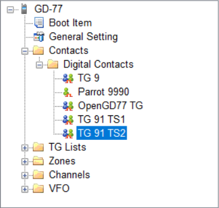

Next create one or more “**TG Lists**” and populate each with the sets of the *Talkgroups* that you will want to use with different channels. You can have the same *Talkgroups* in **many** *TG Lists*.

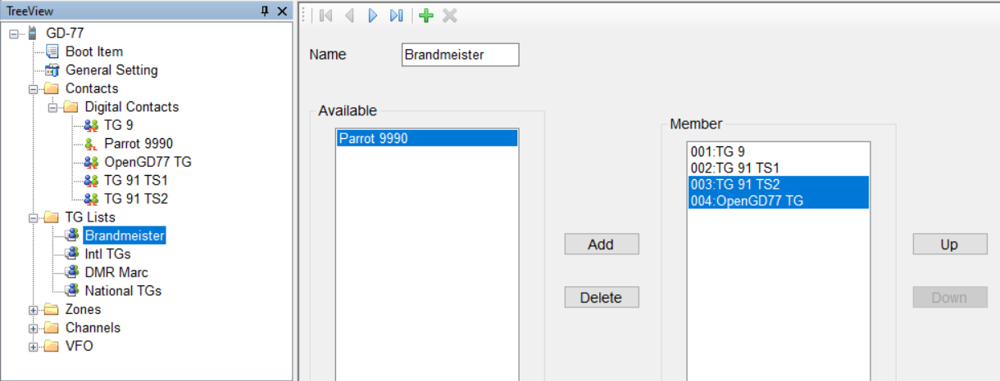

Now setup the **Channels**. Enter the frequencies, slot and color code as normal for a DMR channel.

Next select the **TG List** that you wish to use for the channel.

The firmware can use the *TG list* to filter the incoming DMR signal, or it can operate in “*Digital Monitor Mode*” (aka promiscuous mode) all the time. This can be set in the radio quick menu setting for **Filter** and **DMR filter**.

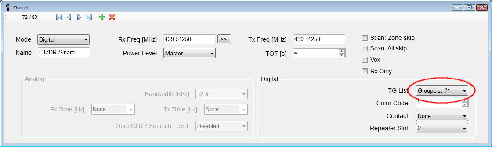<!-- { width=600 } -->

*Note:*

- You must use the *TG list* to define the TG’s you want to use with each Channel. Hence you must have at least **1 TG list** and it must contain at least **1 Digital Contact** which is a *TalkGroup*.

Finally save your codeplug to your computer before writing the code plug to the radio using either the standard Radioddity CPS to program the radio before flashing it to OpenGD77, or, if you are using the special OpenGD77 compatible version of the CPS, (as detailed in the next section) you can write the codeplug directly to an already flashed OpenGD77 radio.

#### New Driver Installation<!-- linebreak -->

The CPS installer now also installs the comm port driver, however the comm port driver can be installed manually by downloading the files from
<https://github.com/rogerclarkmelbourne/OpenGD77/tree/master/OpenGD77CommDriver>

To install the driver, download and unzip the zip file, and run the .bat file

Once the driver is installed, the Windows device manager should show the “**OpenGD77**” in the “*ports*” section of the Windows device manager

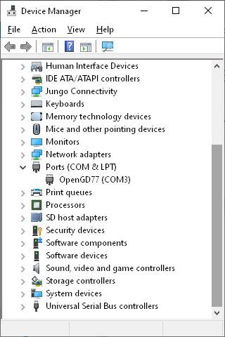<!-- { width=280 } -->

#### OpenGD77 Menu<!-- linebreak -->

In the CPS, there is a new menu item under the Extras menu, for OpenGD77 Support, which opens this window.

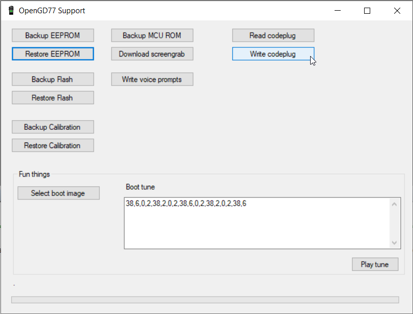<!-- { width=480 } -->

From here you can **backup** the internal **64k EEPROM** and the **1 mega byte Flash** chip, as well as Reading and Writing the codeplug.

The calibration data stored in the Flash chip (At address *0x8f000*) can be backed up and restored without backing up the whole of the Flash.

*Note:*

- If you restore the Flash you will also **overwrite the calibration data** as it’s stored in the 1Mb Flash chip.

You can also use this window to grab a screenshot from the radio's current display. Screenshots are saved in PNG format.

#### Backup Before You Do Anything Else<!-- linebreak -->

Before writing a codeplug to the radio the first time, you should **backup both the EEPROM and Flash** chip, and save the files in a **safe place**, in case something goes wrong in the future and you need to restore the data.

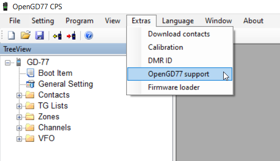

Backup the **EEPROM**, **Flash memory**, **Calibration data**, **MCU ROM** and the **Codeplug**.

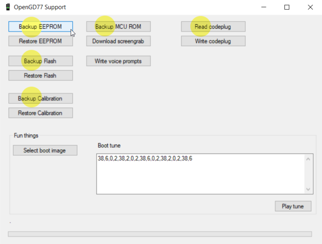

#### Reading and Writing Your Codeplug<!-- linebreak -->

To read the codeplug, press the “Read codeplug” button, wait for all 3 data sections to download, and then close the OpenGD77 Support window. To write a codeplug press the “Write codeplug” button.

#### Writing DMR IDs -- the User Database<!-- linebreak -->

The firmware supports **extended DMR ID information**, with up to 16 characters for Callsign and Name, as well as doubling the memory capacity for DMR IDs.

Please change the Number of characters menu to the desired DMR callsign and name length.

Then, you can add in DMR IDs into the database by **selecting an ID prefix**. You can continue adding DMR IDs based on your commonly heard prefixes until you fill up the allocation.

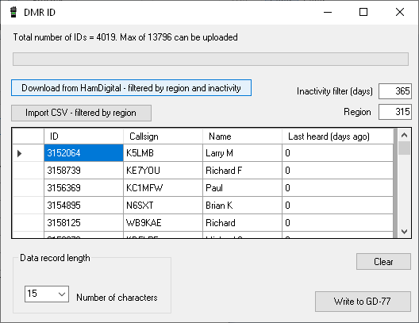<!-- { width=550 } -->

*Note:*

- Because the memory size used for the DMR ID is **limited**, you can store more DMR IDs if you assign fewer characters per ID. Depending on actual information, the firmware can store approximately **13,000** to **26,000** IDs in its user database.

As the firmware supports **Talker Alias**, you might find this sufficient. The firmware will display Callsign and Name data retrieved from the DMR stream, for user IDs not stored in your radio's User Database.

#### Boot tune<!-- linebreak -->

The tones are in pitch, delay pairs. So **38,6** means play **tone 38** (*932Hz A#*) for **6 time periods**.

##### Boot Tune in Morse code<!-- linebreak -->

You can create your callsign in Morse code when turning on the radio. ITU Morse standards have the following ratios:

- **38,6**: dash
- **0,2**: internal pause
- **38,2**: dot
- **0,6**: interchar pause
- **0,7**: interword pause (**unused in a Callsign**)

Or perhaps more usefully:

- **Dah**: 38,6,0,2,
- **Dit**: 38,2,0,2,

  and change the terminating "**2**" to a **6** between letters. (*No comma on the very end*).
  
  So **KI4** (*for example*) would become:
  
  - **38,6,0,2, 38,2,0,2, 38,6,0,6,**
  - **38,2,0,2, 38,2,0,6,**
  - **38,2,0,2, 38,2,0,2, 38,2,0,2, 38,2,0,2, 38,6,0,6**
- Remove the spaces and carriage returns once you've got it all worked out and paste into the Boot Tune section under Extras/OpenGD77 support

##### Melodies and Notes<!-- linebreak -->

For reference, the tone values in OpenGD77 are:

| **Value** | **Note** | **Freq** | **(info)** | | | **(Hz)** | | | | | | | | | |
| --- | --- | --- | --- | --- | --- | --- | --- | --- | --- | --- | --- | --- | --- | --- | --- |
| **1**  | A  | 110  | (A2) | 13 | A  | 220 | | 25 | A  | 440 | | 37 | A  | 880 |   |
| **2**  | A# | 116.5 | | 14 | A# | 223   | | 26 | A# | 466 | | 38 | A# | 932.3 | |
| **3**  | B  | 123.5 | | 15 | B  | 247   | | 27 | B  | 494 | | 39 | B  | 987.8 | |
| **4**  | C  | 130.8 | (C3) | 16 | C  | 261 | (C4 mid c)| 28 | C  | 587.3| (C5) | 40 | C  | 1046.5 | (C6) |
| **5**  | C# | 138.5 | | 17 | C# | 277   | | 29 | C# | 554.3 | | 41 | C# | 1108.7 | |
| **6**  | D  | 146.8 | | 18 | D  | 294   | | 30 | D  | 587.3 | | 42 | D  | 1174.7 | |
| **7**  | D# | 155.5 | | 19 | D# | 311   | | 31 | D# | 622.3 | | 43 | D# | 1244.5 | |
| **8**  | E  | 164.8 | | 20 | E  | 329.6 | | 32 | E  | 659.3 | | 44 | E  | 1318.5 | |
| **9**  | F  | 174.6 | | 21 | F  | 349   | | 33 | F  | 698.5 | | 45 | F  | 1397 | |
| **10** | F# | 185   | | 22 | F# | 370   | | 34 | F# | 740 | | | | | |
| **11** | G  | 196   | | 23 | G  | 392   | | 35 | G  | 784 | | | | | |
| **12** | G# | 207.6 | | 24 | G# | 415.3 | | 36 | G# | 830.6 | | | | | |

#### Boot Image<!-- linebreak -->

The Boot image needs to be **128 wide x 64 pixels high**. It needs to be in **1-bit png format**. (*An indexed image format that is not supported by some modern paint programs*).
<!-- linebreak -->
### Voice prompts<!-- linebreak -->

Voice prompts are not part of the radio firmware, and have to be loaded separately using the CPS.
They are stored in the Flash memory chip.

When Voice prompts are loaded into the radio, the Sound Options->Prompt: setting is automatically changed to "Voice" so that the prompts become immediatly operational.

### Hardware problems and other errata

* Some older GD-77 radios appear to have a hardware fault in the C6000 DMR chip. This problem is manifest by the Beep not working when the beep level is set very low e.g. -12dB. The DMR audio can also cease to work. Increasing the Beep volume to 0dB can sometimes fix this problem, but there it has not be possible to find a firmware solution to this hardware bug, which works 100% of the time on the older radios
* Internal voltage regulation on the Baofeng RD-5R is quite bad. It can result in the LEDs and display backlight flickering during DMR transmission on higher power settings, and is noticable even on low power settings.
* Internal voltage smoothing on the Baofeng DM-1801 and RD-5R is not as good as on the GD-77 and this can result in noise being heard during Rx
* Because the firmware has features like display backlight dimming and changing the beep volume, which are not available in the official firmware for any of the supported radios, some individual radios can have problems. However so that 99%+ of users can enjoy these features they have been retained in the firmware.
* The USB connection to all radios is susceptible to RF injection during transmission. Also RF injection has been known to interfere with the PTT control when connecting via long external PTT cables.  This is not a problem in the firmware and needs to be dealt with by the radio's operator fitting the appropriate screening and RF filtering to USB and PTT cables etc, if they are used during transmission.
* The RD-5R is very susceptible to RF injection, which makes it almost impossible to be used as a hotspot.
* RF injection to the mic audio input is also common when using external microphones, and results in "mototboating" on DMR, unless appropriate filtering is used
* The cases of these radios are not shielded and they are also sensitive to nearby high power radio transmissions on unrelated frequencies.
* The RF chip (AT1846S) used in these radios is also susceptible to high power transmissions on unrelated frequencies, via the antenna RF input, even if the case is shielded.
* The RF chip is not very good at detecting individual CTCSS tones, and has a fairly wide pass band of around 10Hz
* The RD-5R RF design is compromised by its small form factor and lacks separate RF stages for VHF and UHF, which results in much worse RF performance than the GD-77 and DM-1801
* The 100Mhz FM broadcast feature of the RD-5R is not supported, because no data sheet is available for the separate RF chip used for this.
