# OpenGD77 / OpenGD77S / OpenDM1801 / OpenRD5R 用户指南

翻译：BH4ESK  
校对：BG5IPF

获取最新消息或与我们讨论，请到我们的官方论坛 https://opengd77.com

<!-- TOC titleSize:2 tabSpaces:2 depthFrom:1 depthTo:6 withLinks:1 updateOnSave:1 orderedList:0 skip:0 title:1 charForUnorderedList:* -->

## 目录
- [OpenGD77 / OpenGD77S / OpenDM1801 / OpenRD5R 用户指南](#opengd77--opengd77s--opendm1801--openrd5r-用户指南)
  - [目录](#目录)
  - [简介](#简介)
    - [下载链接与其他资源](#下载链接与其他资源)
  - [安装](#安装)
  - [电台配置文件（Codeplug）兼容性](#电台配置文件codeplug兼容性)
  - [不同电台之间的固件差异](#不同电台之间的固件差异)
  - [主屏幕（频率与信道界面）](#主屏幕频率与信道界面)
    - [在模拟与数字模式之间切换](#在模拟与数字模式之间切换)
    - [在DMR模式下切换时隙](#在dmr模式下切换时隙)
    - [控制发射功率](#控制发射功率)
    - [信号强度条（S表）](#信号强度条s表)
    - [信道界面的特殊功能](#信道界面的特殊功能)
      - [在当前区域内切换信道](#在当前区域内切换信道)
      - [改变区域](#改变区域)
    - [显示信道频率](#显示信道频率)
    - [显示FM模式具体信道信息](#显示fm模式具体信道信息)
    - [上行监听功能](#上行监听功能)
      - [信道界面快捷菜单](#信道界面快捷菜单)
        - [拷贝一个信道配置至VFO（Channel --> VFO）](#拷贝一个信道配置至vfochannel----vfo)
        - [将VFO信息写入当前信道（VFO --> Channel）](#将vfo信息写入当前信道vfo----channel)
        - [过滤器设置（Filter）](#过滤器设置filter)
          - [FM模式的过滤设置（哑音）](#fm模式的过滤设置哑音)
          - [DMR模式的过滤设置](#dmr模式的过滤设置)
        - [色码过滤（CC Filter）（仅限DMR模式）](#色码过滤cc-filter仅限dmr模式)
        - [时隙过滤（TS Filter）（仅限DMR模式）](#时隙过滤ts-filter仅限dmr模式)
      - [VFO界面快捷菜单](#vfo界面快捷菜单)
        - [选择VFO A/B](#选择vfo-ab)
        - [交换接收与发射频率（Tx <--> Rx）](#交换接收与发射频率tx----rx)
        - [将接收频率拷贝至发射频率（Rx --> Tx）](#将接收频率拷贝至发射频率rx----tx)
        - [将发射频率拷贝至接收频率（Tx --> Rx）](#将发射频率拷贝至接收频率tx----rx)
        - [过滤器（Filter）（仅限DMR模式）](#过滤器filter仅限dmr模式)
      - [存储VFO配置至新建信道（VFO --> New Chan）](#存储vfo配置至新建信道vfo----new-chan)
        - [哑音扫描（Tone Scan）（仅限FM模式）](#哑音扫描tone-scan仅限fm模式)
    - [与DMR有关的一些设定](#与dmr有关的一些设定)
      - [时隙选择](#时隙选择)
      - [DMR ID、呼号与名字显示](#dmr-id呼号与名字显示)
      - [主叫别名显示](#主叫别名显示)
      - [从接收组列表中选择通话组](#从接收组列表中选择通话组)
      - [为联系人或通话组指定时隙](#为联系人或通话组指定时隙)
      - [通话组反色显示](#通话组反色显示)
      - [手动输入通话组代码](#手动输入通话组代码)
      - [输入单呼号码](#输入单呼号码)
      - [选择联系人](#选择联系人)
      - [临时修改您的DMR ID](#临时修改您的dmr-id)
    - [与FM有关的一些设定](#与fm有关的一些设定)
      - [窄带FM](#窄带fm)
      - [哑音设置](#哑音设置)
      - [静噪](#静噪)
      - [1750Hz音频脉冲发射操作](#1750hz音频脉冲发射操作)
      - [双音多频（DTMF）发射操作](#双音多频dtmf发射操作)
    - [与VFO有关的一些设定](#与vfo有关的一些设定)
      - [频率步进](#频率步进)
      - [使用数字键盘输入频率](#使用数字键盘输入频率)
      - [单独调整发射频率](#单独调整发射频率)
  - [发射](#发射)
    - [超时提示音（Timeout beep）](#超时提示音timeout-beep)
    - [发射超时定时器（TOT）](#发射超时定时器tot)
  - [扫描功能](#扫描功能)
    - [信道扫描](#信道扫描)
    - [频率扫描](#频率扫描)
  - [其他界面](#其他界面)
    - [锁屏界面](#锁屏界面)
    - [文字输入界面](#文字输入界面)
  - [控制按键与按钮](#控制按键与按钮)
  - [菜单系统](#菜单系统)
  - [主菜单](#主菜单)
    - [区域（Zone）](#区域zone)
    - [信号强度指示器（RSSI）](#信号强度指示器rssi)
    - [电池（Battery）](#电池battery)
    - [回溯界面（Last Heard）](#回溯界面last-heard)
    - [固件信息（Firmware Info）](#固件信息firmware-info)
    - [选项设定（Options）](#选项设定options)
      - [恢复出厂设置（Fact Reset）](#恢复出厂设置fact-reset)
      - [校准参数（Calibration）](#校准参数calibration)
      - [波段限制（Band Limits）](#波段限制band-limits)
      - [按键长按时间（Key long）](#按键长按时间key-long)
      - [按键重复速度（Key rpt）](#按键重复速度key-rpt)
      - [时隙驻留时间（Filter time）](#时隙驻留时间filter-time)
      - [扫描驻留时间（Scan delay）](#扫描驻留时间scan-delay)
      - [扫描模式（Scan mode）](#扫描模式scan-mode)
      - [UHF静噪（Squelch UHF）](#uhf静噪squelch-uhf)
      - [220M静噪（Squelch 220）](#220m静噪squelch-220)
      - [VHF静噪（Squelch VHF）](#vhf静噪squelch-vhf)
      - [PTT保持（PTT Latch）](#ptt保持ptt-latch)
      - [热点模式（Hotspot）](#热点模式hotspot)
      - [发射别名（TA Tx）](#发射别名ta-tx)
      - [允许单呼（Allow PC）](#允许单呼allow-pc)
    - [显示设定（Display Options）](#显示设定display-options)
      - [背光亮度（Brightness）](#背光亮度brightness)
      - [待机亮度（Min Bright）](#待机亮度min-bright)
      - [对比度（Contrast）](#对比度contrast)
      - [背光模式（Display mode）](#背光模式display-mode)
      - [背光延时（Timeout）](#背光延时timeout)
      - [显示颜色模式（Colour mode）](#显示颜色模式colour-mode)
      - [联系人显示顺序（Order）](#联系人显示顺序order)
      - [联系人显示方式（Contact）](#联系人显示方式contact)
    - [声音设定（Sound Options）](#声音设定sound-options)
      - [超时警告（Timeout beep）](#超时警告timeout-beep)
      - [警告音量（Beep volume）](#警告音量beep-volume)
      - [DMR提示音（DMR Beep）](#dmr提示音dmr-beep)
      - [DMR麦克风增益（DMR mic）](#dmr麦克风增益dmr-mic)
      - [FM麦克风增益（FM mic）](#fm麦克风增益fm-mic)
      - [VOX阈值（VOX threshold）](#vox阈值vox-threshold)
      - [VOX延迟（VOX Tail）](#vox延迟vox-tail)
    - [信道详细设置（Channel Details）](#信道详细设置channel-details)
      - [接收频率（RX）](#接收频率rx)
      - [发射频率（TX）](#发射频率tx)
      - [模式（Mode）](#模式mode)
      - [色码（Color Code）](#色码color-code)
      - [时隙（Timeslot）](#时隙timeslot)
      - [接收/发射组（Tx/RX Grp）](#接收发射组txrx-grp)
      - [发射哑音（Tx CTCSS or DCS）](#发射哑音tx-ctcss-or-dcs)
      - [接收哑音（Rx CTCSS or DCS）](#接收哑音rx-ctcss-or-dcs)
      - [带宽（Bandwidth）](#带宽bandwidth)
      - [步进（Step）](#步进step)
      - [超时定时器（TOT）](#超时定时器tot)
      - [跳过区域（Zone Skip）](#跳过区域zone-skip)
      - [跳过信道（All Skip）](#跳过信道all-skip)
      - [声控发射（VOX）](#声控发射vox)
      - [保存对信道的更改](#保存对信道的更改)
    - [致谢（Credits）](#致谢credits)
  - [发起或接收单呼](#发起或接收单呼)
    - [想要发起单呼的话](#想要发起单呼的话)
    - [当接收到一个单呼时](#当接收到一个单呼时)
  - [热点模式（Hotspot mode）](#热点模式hotspot-mode)
  - [重设电台各项设定](#重设电台各项设定)
  - [关于MD730的操作方式](#关于md730的操作方式)
    - [MD730 信道/通话组模式](#md730-信道通话组模式)
    - [MD730 扫描模式](#md730-扫描模式)
    - [MD730 时隙模式](#md730-时隙模式)
    - [MD730 色码模式](#md730-色码模式)
    - [MD730 DMR过滤模式](#md730-dmr过滤模式)
    - [MD730 区域模式](#md730-区域模式)
    - [MD730 功率模式](#md730-功率模式)
- [关于OpenGD77 CPS写频软件的说明](#关于opengd77-cps写频软件的说明)
<!-- /TOC -->

## 简介

本用户手册及其系统固件（OpenGD77, OpenGD77S, OpenDM1801 以及 OpenRD5R）现处于原始开发阶段。*

> *译者注：GD77/GD77s对应国内型号特易通 MD760/MD730，DM1801/RD-5R对应国内型号宝峰DM1801/DM-5R mk2，为了便于大家理解，下文机型将统一替换为国内型号。

由于更新较为频繁，部分图文描述可能与实际存在较大出入。 
当固件的某一部分稳定后，图片会重新更新。

本项目的目的旨在开发一个功能齐全的、非商用的固件，借此代替特易通MD760/MD730与宝峰DM1801/DM-5R的原有操作系统。  
该固件专为**业余无线电用户**使用打造，同时含有一些官方固件所没有的功能。

**请注意：**
**本固件依然处于开发阶段，仍有一些官方固件支持的关键功能在本固件内不被支持。**

短信息发送与接收功能目前暂时不支持，但有可能在将来会被支持。

双守功能没有被支持，并可能永远不会被支持，因为该功能可以使用频道（Channel）/区域（Zone）扫描功能所代替。
扫描列表功能同样没有被支持，因为频道/区域扫描同样可以提供几乎相当的功能。

隐私与加密功能将不会被支持，因为对于业余电台使用该功能是非法的行为。在某些国家或地区（例如澳大利亚），由于政府与法律要求，开发者被要求在任何加密系统中植入后门，实际上让开发一个含有加密的系统变得违法或者不可能。

省电功能暂时没有开发，因此本固件在无信号的接收状态下耗电更高。将来可能会添加一些省电功能，然而某些高级功能，例如S表，如果使用了省电，将无法运行。

### 下载链接与其他资源

**固件源码:**

**最新版本:**
<https://github.com/rogerclarkmelbourne/OpenGD77/releases>

**带有新功能的OpenGD77 CPS写频软件:**
<https://github.com/rogerclarkmelbourne/OpenGD77CPS/releases>

**OpenGD77论坛:**
<https://www.opengd77.com/>

## 安装

本固件可以被安装在以下几部电台

* 特易通 MD-760
* 特易通 MD-730
* 宝峰 DM-1801
* 宝峰 DM-5R

固件文件可以使用附带的FirmwareLoader.exe安装，也可使用特易通或者宝峰官方提供的固件更新工具进行安装。

安装本固件的风险由您自行承担，若遇到任何问题，请尝试重新刷入官方固件。  
**刷机成功后，建议您使用OpenGD77 CPS备份整个固件**

> 译者注：同时按住两个侧边按键并打开电台可以进入固件刷写模式

*请注意 :* 电台官方的CPS与本固件的 OpenGD77写频软件 不兼容，请使用本固件提供的软件进行写频。OpenGD77写频软件可以从本指南的1.1章节处下载。宝峰DM1801也必须使用这个软件。

## 电台配置文件（Codeplug）兼容性

本固件所使用的电台配置文件与官方的略有不同。  

如果您使用的电台型号不是MD760，则需要对配置文件格式进行转换。感谢Colin G4EML编写了一个软件可以将原厂专用的文件转换为CSV格式，您可以在[这里](http://www.gb3gf.co.uk/downloads.html)下载。使用该软件可以将专用的电台配置文件导出至CSV文件，再通过OpenGD77写频软件导入。

电台配置文件只能使用OpenGD77 CPS写入到电台。

我们推荐您检查已有的信道列表，将频率重复但通话组不同的信道删除。更多信息请参阅本指南尾部的‘为本固件写入信道与通话组’。

## 不同电台之间的固件差异

不是所有受支持的电台都有相同的按键数或屏幕大小，因此操作这些电台会与操作MD760有些不同之处。此外，并不是所有的电台都支持全部的功能。

* 宝峰 DM-5R 的硬件不支持在电台发射时通过USB进行通讯，所以热点模式在这台电台上无法使用。

* 宝峰 DM-5R 没有左右方向键，由 **A/B** 和 **Band** 按键代替 **左方向键** 和 **右方向键**

* 宝峰 DM-5R 没有橙色按键，该功能由长按橙色的 **MR/VFO** 代替。

* 宝峰 DM-5R 有两个侧键，但是其位置与MD760和DM1801不同，位于PTT上方的是MD760上的 **黑色按键** （或称为SK1），位于PTT下方的是MD760上的 **蓝色按键** （或称为SK2）.

* 宝峰 DM-5R 作为热点效果差强人意，因为其射频输出实在是太差劲了，并且会对树莓派（甚至其他系统）造成严重的射频干扰导致USB连接失效。

* MD730没有键盘或者屏幕，因此操作方式与其他有屏幕的电台完全不同。

对于MD730的操作请看附录 [关于MD730的操作方式](#关于md730的操作方式)

* 宝峰 DM1801 有独立的 **MR/VFO** 按键，可用于切换信道/频率模式，而不需要使用 **红色** 的菜单键

* 宝峰 DM1801 也有独立的 **A/B** 按钮，用于切换A/B频率，而不需要使用机顶的 **橙色** 按钮进入快速菜单再切换。

## 主屏幕（频率与信道界面）

本固件有两个主屏幕：频率界面（VFO）与信道界面（Channel）。这与原装固件的界面类似，但拥有了更多功能。  
在本固件安装完成后，默认显示VFO界面。

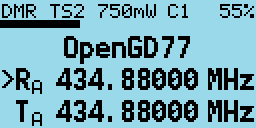

VFO界面显示的发射与接收频率会从电台配置文件（Codeplug）中的“VFO A”配置读取

无论在VFO或信道界面，当前模式（DMR/FM）都会显示在屏幕左上角，电量百分比会显示在右上角。

在DMR模式中，当前时隙会显示在“DMR”右侧，例如时隙2会显示为 **“TS2”** ，色码会显示在电池左侧，例如色1会显示为 **“C1”** ，当时隙过滤关闭时，**“TS1”** 或 **“TS2”** 会反色显示。

当前的发射功率会显示在屏幕顶部中间，例如 **“750mW”** 

在VFO界面，发射与接收频率都会显示，当处于DMR模式的时候，通话组也会同时显示。

R（接收频率）左侧的小箭头表示当前控制的是接收频率，使用上下箭头按键或数字键可以改变接收频率。

信道界面会在顶部显示与VFO界面相同的内容，中间则显示信道名称（此处为“Lee Hill”）与区域（此处为“Home DMR”）。在DMR模式下还会显示通话组（此处为“ColoradoHD”）。

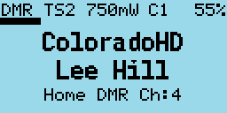

在这两个界面中:

按压 **红色** 菜单按钮可以在VFO界面与信道界面之间切换。

注意在宝峰DM1801和DM5R上，按压 **MR/VFO** 按键以切换频率/信道界面。

按压 **绿色** 菜单按键进入菜单选项。

按压 **蓝色+绿色** 组合键快速进入信道信息界面，该界面同样可以从菜单进入。

*请注意 :*
VFO实际上是一种特殊的信道，因此信道信息界面同样适用于频率界面。

### 在模拟与数字模式之间切换

按压 **蓝色+星号** 组合键可以在FM和DMR模式之间切换，该操作适用于任意信道和VFO

### 在DMR模式下切换时隙

在DMR模式下，按压 **星号** 按键以切换时隙1与时隙2

### 控制发射功率

按压 **蓝色+右** 组合键以增加功率。按压 **蓝色+左** 组合键以减小功率。功率可以被设置为以下几档：50mW、250mW、500mW、750mW、1W、2W、3W、4W、5W 以及 5W++。

5W++功率档位会将功放芯片驱动到极限。  
该功率仅为供应急使用而设计，在70cm段输出约5.5W，在2m段输出约7W。  
要选择该功率档位，首先选择5W档位，然后按住 **蓝色+右** 组合键

*请注意 :*

（1）功率档位有且只有在您校准了手中的电台之后才准确，而这些电台在出厂时似乎并未精确校准其功率。

（2）本固件并没有使用原厂的两档高/低功率设定，而是10档功率可调。

### 信号强度条（S表）

在FM与DMR模式中，接收信号的强度表现为横跨屏幕一个条形图（S表）。S表指示在最右端时大约为S9+40dB。

在DMR模式中，只有当硬件检测到DMR信号时S表才会工作。

在FM模式中，S表应一直工作。

### 信道界面的特殊功能

信道界面显示了当前信道号码（Channel）与当前区域（Zone）。

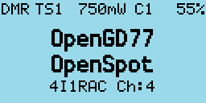

#### 在当前区域内切换信道

按压 **上** 或 **下** 方向键可以在当前区域内改变信道，信道号会显示在区域号的边上。

#### 改变区域

按压 **蓝色+上** 或 **蓝色+下** 分别可以切换上一个/下一个区域。

### 显示信道频率

在FM与DMR模式中，都可以按住 **黑色** 侧键以显示接收与发射频率。

### 显示FM模式具体信道信息

在FM模式中，按住 **黑色** 侧键以显示例如哑音以及静噪等设置。

### 上行监听功能

按压 **黑色** 侧键，然后按 **蓝色** 按键，可以启用上行监听。*  
该功能同时会显示信道信息，且同时适用于FM和DMR模式。

> *译者注：该功能与倒频类似，按住可暂时交换接收与发射频率，将中继使用的上行与下行频率颠倒，可用于在不改变对方参数的情况下接收对方上行信号。

#### 信道界面快捷菜单

按压机器顶部 **橙色** 按键可以调出信道界面的快捷菜单。在该菜单下 **橙色** 按键和 **绿色** 按键具有相同的功能，都可以确认当前选项。

*请注意 :* 宝峰DM5R没有顶部的橙色按键，请长按MR/VFO按键以访问该快捷菜单。

##### 拷贝一个信道配置至VFO（Channel --> VFO）

按压 **橙色** 按键，或按压 **绿色** 按键以拷贝当前信道配置至频率界面。

##### 将VFO信息写入当前信道（VFO --> Channel）

按压 **橙色** 按键，或按压 **绿色** 按键以确认，按压 **红色** 按键以取消。

##### 过滤器设置（Filter）

###### FM模式的过滤设置（哑音）

使用 **左** 箭头或者 **右** 箭头以开启或关闭哑音

###### DMR模式的过滤设置

使用 **左** 箭头或者 **右** 箭头以选择：
* **None** (不过滤，用于监听任何频率活动)
* **TG** (按选中的通话组过滤组呼)
* **Ct** (按预存联系人过滤单呼)
* **RxG** (按接收组列表过滤组呼)

启用过滤时，屏幕中间上方的“DMR”指示会反色显示。

##### 色码过滤（CC Filter）（仅限DMR模式）

色码过滤可以过滤与您的色码不相同的电台信号。  
使用 **左** 按键，或 **右** 按键以开关该功能。  

关闭色码过滤时，屏幕上的色码指示会反色显示。

##### 时隙过滤（TS Filter）（仅限DMR模式）

时隙过滤可以让您选择两个时隙中的一个进行通联。  
使用 **左** 按键，或 **右** 按键以开关该功能。  

关闭时隙过滤时，屏幕上的时隙指示会反色显示。

#### VFO界面快捷菜单

在VFO界面，按压机器顶部的 **橙色** 按键进入快捷菜单，目前该菜单有五个选项。

*请注意 :* 宝峰DM5R没有顶部的橙色按键，请长按MR/VFO按键以访问该快捷菜单。

##### 选择VFO A/B

在VFO界面，按压两次 **橙色** 按键以切换VFO A/B

*请注意 :* 在宝峰DM1801上，该功能由按压一次 **A/B** 按键实现。

##### 交换接收与发射频率（Tx <--> Rx）

该功能即倒频功能，在VFO界面，按压 **绿色** 或 **橙色** 按键以确认。

##### 将接收频率拷贝至发射频率（Rx --> Tx）

将接收频率拷贝至发射频率，按压 **绿色** 或 **橙色** 按键以确认

##### 将发射频率拷贝至接收频率（Tx --> Rx）

将发射频率拷贝至接收频率，按压 **绿色** 或 **橙色** 按键以确认。

##### 过滤器（Filter）（仅限DMR模式）

该功能与先前描述过滤器功能相同，此处不再赘述。

#### 存储VFO配置至新建信道（VFO --> New Chan）

该选项会将当前VFO设定存储至一个新建信道。  
新建信道名称将遵循"New channel NNN"格式，其中“NNN”代表“All Channels”区域中下一个可用的频道号码。  
新建信道不会被添加到任何区域，但可在“All Channels”中找到。

##### 哑音扫描（Tone Scan）（仅限FM模式）

该功能可以扫描模拟（CTCSS）或数字（DCS）哑音，找到正确的哑音后设置将被存入当前VFO。  

本功能默认会扫描 **CTCSS和DCS** ，但如果您只想扫描CTCSS或者DCS，按压 **左** 或 **右** 方向键以选择对应哑音。

按压 **橙色** 或 **绿色** 按键以确认存入，或按压 **红色** 按键以取消。

取消哑音扫描后，接收频率的哑音设置会回到之前的设定。

若扫描到对应的哑音，接收与发射频率都会被设置为扫描到的哑音频。

### 与DMR有关的一些设定

 这些操作在VFO与信道界面都可以执行

#### 时隙选择

按压数字键盘上的 **星号** 按键可以切换时隙1与时隙2。

#### DMR ID、呼号与名字显示

当接收到与您设定的色码相同的DMR信号时，电台会显示该主叫电台的通话组以及DMR ID。

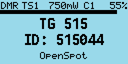

若该DMR ID之前已预先加载于电台的ID数据库内，则会显示该电台的呼号与名字。

#### 主叫别名显示

若收到的信号来自Brandmeister网络，且主叫DMR ID并未记录在电台的数据库中，则会显示由Brandmeister发送过来的别名。

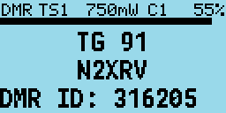

呼号会显示在屏幕中央，额外的信息会显示在屏幕底部，默认情况下该信息是DMR ID

若主叫电台在Brandmeister的“Self care”页面APRS栏目中输入了任何信息（即别名数据），则该信息会代替DMR ID出现在屏幕下方。

*请注意 :* 由于主叫别名数据是嵌入在DMR语音数据帧中一同传送的，呼号通常会先出现，大约一秒后DMR ID与其他文字信息才会显示。

#### 从接收组列表中选择通话组

按压 **左** 方向键或 **右** 方向键，可以在事先写入的接收组列表中选择不同的通话组。
该通话组会同时应用于接收与发射（频率）。

*请注意 :* 宝峰DM5R没有左右方向键，请使用A/B按键代替左方向键，使用Band按键代替右方向键。

#### 为联系人或通话组指定时隙

CPS软件最近新增的一个功能允许您为每个联系人或通话组指定一个时隙。

默认状态下，信道时隙指定功能是关闭的。这意味着如果您在接收组列表中按压 **左** 方向键或 **右** 方向键选择通话组，时隙不会改变。

若联系人被指定了一个特定时隙（例如时隙1），当该联系人被选中时，时隙会自动设置为该指定时隙。

#### 通话组反色显示

若通话组标识在您接收到DMR信号时反色显示，则表明您的通话组与接收到的通话组并不相符，因此当您按下PTT时，您的信号不会被发送至接收到的通话组，而是您设置的通话组。

如果您想要与接收到的信号在同一组发射，在通话组反色显示期间，按压电台侧边的 **蓝色** 侧键可以将您的通话组设置为接收到的通话组。

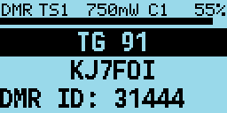

#### 手动输入通话组代码

按压数字键盘的 **井号** 按键进入通话组输入界面。  
您可以手动输入通话组代码，该通话组代码是临时的，按压 **绿色** 按键以确认。  
若您输入的通话组在联系人数据库中，该通话组的名称会直接显示，否则，通话组的号码会被显示（例如 TG 98977）。

按压任意 **左** 方向键或 **右** 方向键可以退出并回到上一个通话组。

当您手动输入通话组代码时，通话组周围会显示一圈框线以提示您当前通话组是临时的。

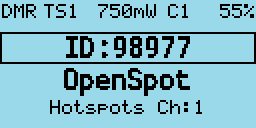

#### 输入单呼号码

按压数字键盘 **井号** 按键两次，然后手动输入需要单呼的DMR ID。

在所有的数字键盘输入界面中，按压 **红色** 按键都可以返回上一个界面。

#### 选择联系人

按压数字键盘 **井号** 按键三次，可以进入联系人选择界面。

联系人姓名会显示在屏幕中央（例如TG 505 TS2）通话组或单呼号码会显示在屏幕底部。  
按压 **下** 方向键或 **上** 方向键可浏览联系人列表。  
按压 **绿色** 按键以选择该联系人，或按压 **红色** 按键以取消。  
也可使用该方法发起单呼。

#### 临时修改您的DMR ID

该功能仅用于测试用途。  
在联系人选择界面，按压 **蓝色功能键+井号** 组合键可以临时修改您的DMR ID。

直到您再次修改ID，或关闭、重启电台为止，该临时ID会一直生效。

若想要让此更改永久生效，请在输入界面按压 **蓝色功能键+绿色** 组合键以确认。

### 与FM有关的一些设定

#### 窄带FM

对于25kHz频宽的FM模式，屏幕左上角会显示“FM”，对于12.5kHz的窄带FM模式，屏幕左上角会显示“FMN”

#### 哑音设置

信道或VFO都可设置哑音。屏幕左上角显示的“C”，“D”，“T”，“R”或“TR”代表了不同的哑音设定。
其中，**C** 代表CTCSS，**D** 代表DCS，**T** 代表发射哑音，**R** 代表接收哑音，**TR** 代表接收与发射哑音。

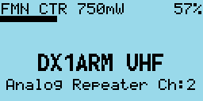

接收与发射哑音是可以进行单独设置的。

#### 静噪

按压 **左** 方向键或 **右** 方向键，可以设置FM静噪的强度。

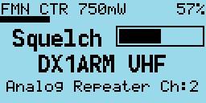

在静噪设置界面，按压 **左** 方向键会关小静噪，按压 **右** 方向键会开大静噪。信道界面与VFO界面的静噪等级是独立的，可以单独调整。静噪可以按5%的步进设置。 

在新版CPS软件内，每个信道或VFO都可以被指定不同的静噪等级。

在这个例子中静噪被设置为20%

若在VFO界面改变静噪等级，即便您关闭或重启了电台，该数值依旧会被记忆。但是在信道界面，改变静噪只是暂时的。

在信道界面，若想要让您设置的静噪永久生效，按压 **蓝色功能键+绿色** 组合键以进入信道信息界面，然后再次按压 **绿色** 按键以保存您的设置。

*请注意 :* 若您设置了接收哑音，则该设置比接收静噪具有更高优先级，降低静噪等级并不会使您的电台打开静噪。

#### 1750Hz音频脉冲发射操作

在FM模式的发射中，按压 **蓝色功能键** 可以发射1750Hz音频脉冲。*

> *译者注：该功能常用于访问欧洲的中继台。

#### 双音多频（DTMF）发射操作

在发射中，按压任意数字键盘按键，可以发射DTMF音频，该音频同时会从电台扬声器中发出。

### 与VFO有关的一些设定

VFO界面在任何时候都会显示接收与发射频率。

当您选中接收频率时，“R”左侧会显示一个小箭头，此时改变频率会同时改变接收与发射频率。

#### 频率步进

按压 **上** 方向键或 **下** 方向键可以以预先设置的频率步进改变频率。
想要调整频率步进，可以按压 **蓝色功能键+绿色** 进入信道信息界面，选择“Step”选项进行调整。

#### 使用数字键盘输入频率

按压数字键盘上的任意数字可以直接输入频率。

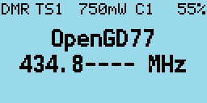

输入完所有数字后，电台会发出确认提示音并回到VFO界面。
若输入的频率无效，电台会发出错误提示音。

当您在输入频率时：

按压 **红色** 按键可取消当前输入。

按压 **左** 方向键可以依次删除输入的数字。

#### 单独调整发射频率

按压 **蓝色功能键** 然后按压 **下** 方向键，可以切换当前选择的频率至发射频率，此时您可以单独调整发射频率。  
按压 **蓝色功能键** 然后按压 **上** 方向键，可以回到接收频率。  
使用这个方法您可以单独调整发射频率，例如用于访问中继台，或进行卫星操作，因为接收与发射频率甚至可以跨段。

*请注意 :* 如果设置了不同的接收与发射频率，当您调整接收频率时，频差会尽可能的保留。若发射频率超出电台硬件能操作的范围时，将会丢弃频差，并保持发射频率不变。

## 发射

在您的电台发射期间，计数器将累加或减少，这取决于您是否设置了发射超时定时器。  
若您设置了发射超时定时器，计数器将会倒计时；若您没有设置发射超时定时器，则计数器将会累加计数。
在DMR 2代标准下，只有当中继台活跃时，计数器才会开始计数。  
无论在FM或DMR发射操作下，在原本S表的位置都会显示一个麦克风电平表（VU表）。

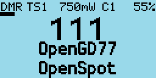

### 超时提示音（Timeout beep）

您可以在声音设定菜单设置超时提示音，当您设置了一个时间，例如10秒，则在接近发射超时前10秒，超时提示音将会每隔5秒鸣响以提示您即将超时。

### 发射超时定时器（TOT）

设置发射超时的时间，在发射时计数器将会倒计时，归零后，电台会停止发射并发出“滴~”的提示音。

## 扫描功能

信道界面与VFO界面都支持扫描，不过两者操作略有不同。

### 信道扫描

长按 **上** 方向键以开始扫描这个区域内的信道。  
按压 **下** 方向键可反转扫描方向。  
在扫描过程中，按压 **左** 方向键可以将当前信道暂时踢出扫描列表（nuisance delete）。  
按压任何其他按键以退出扫描。  
在扫描过程中，相应的“DMR”或“FM”模式标志会闪烁。

### 频率扫描

VFO界面的扫描模式有些特殊，长按 **上** 方向键以进入VFO扫描模式。  
当扫描模式开启时，接收频率显示将会被上下区间频率所代替。  

初始的扫描区间将会设置为当前VFO±1Mhz。

按压数字键盘可以手动输入上下区间频率。  
例如输入：

1 4 4 0 0 0 1 4 8 0 0 0

可将下区间设置为144.000Mhz，上区间设置为148.000Mhz。

再次长按 **上** 方向键以启动扫描。

在扫描模式下，按压 **上** 方向键或 **下** 方向键可以正常调整VFO频率。

按压 **左** 方向键可反转扫描方向。  
按压 **右** 方向键可以将当前VFO暂时踢出扫描列表（nuisance delete）。
按压 **上** 方向键可跳过当前VFO并继续扫描。
按压任何其他按键以停止扫描。  
长按 **下** 方向键以退出VFO扫描模式。

## 其他界面

### 锁屏界面

在任意界面，按压 **绿色** 按键以进入菜单，接着按压数字键盘 **星号** 按键以锁定数字键盘。在任意顶层菜单界面按压数字键盘 **星号** 按键都可以锁定。

按住 **蓝色功能键** 并按压数字键盘 **星号** 按键以解锁。

PTT按键同样可以被锁定，与数字键盘锁定操作类似，在任意顶层菜单界面按压数字键盘 **井号** 按键以锁定PTT。*

> *译者注：数字键盘锁定与PTT锁定是分开的，你可以只锁定任意一项。但是锁定PTT之后，数字键盘并没有一起被锁定，请重复上述数字键盘锁定操作以锁定数字键盘。而解锁操作是同时解锁的，即无论你锁定了什么，当执行解锁操作时会一同解锁。

### 文字输入界面

本固件支持在新建或编辑联系人时输入英文字母。

按压 **左** 或 **右** 方向键可以移动光标，按压 **蓝色功能键+左** 组合键可以退格，按压 **蓝色功能键+右** 组合键可以输入空格。输入方法与英文九宫格输入法类似，在此不进行赘述。

## 控制按键与按钮

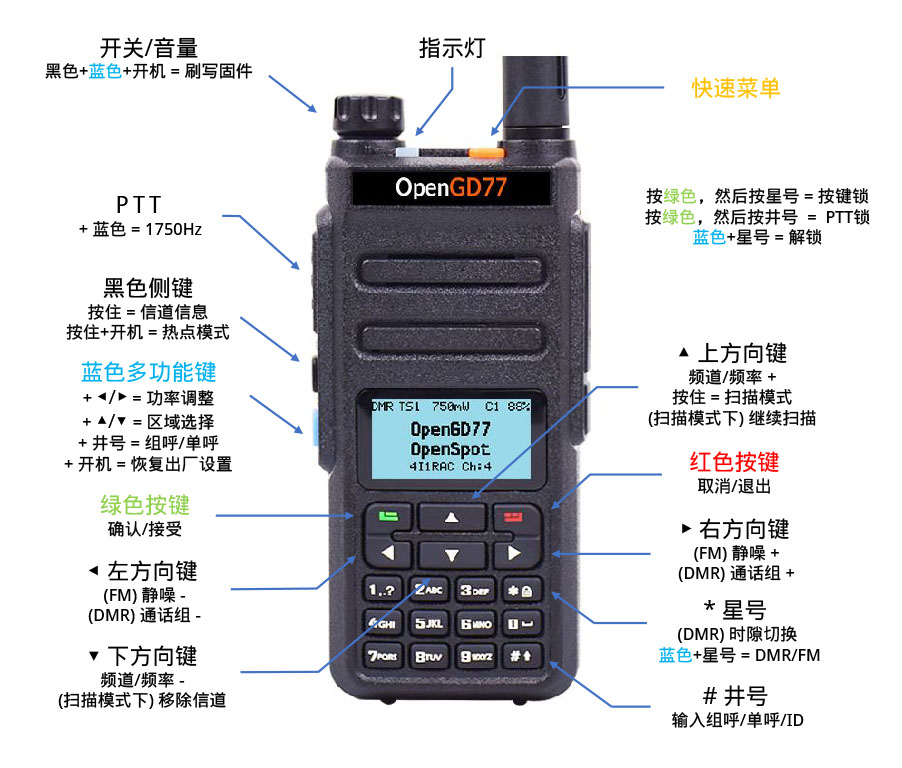

## 菜单系统

与官方固件相比，本固件使用了一个：针对于业余使用、着重于简单明了、突出常用功能、且经过重大修改的菜单。具体结构请参考下面的菜单图。

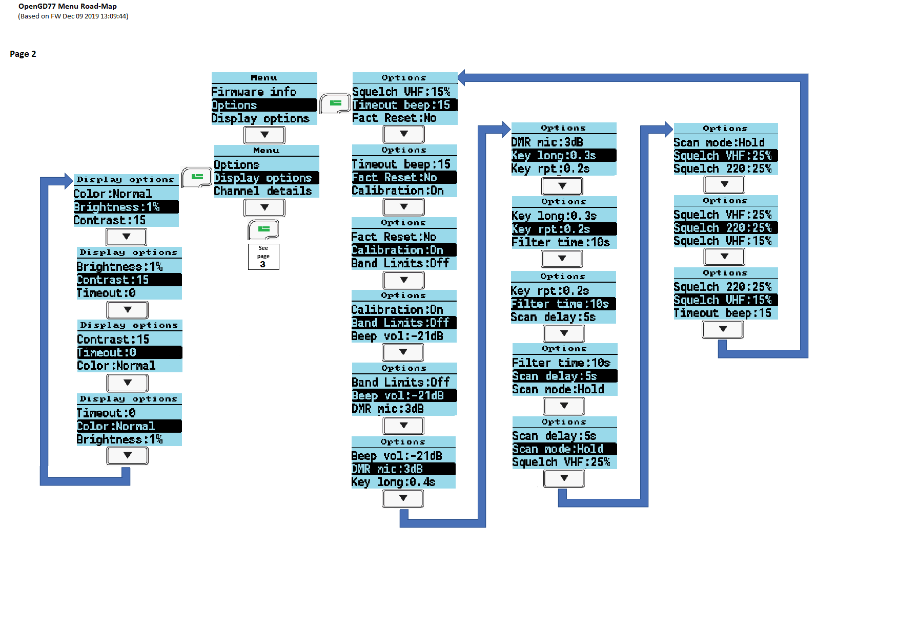

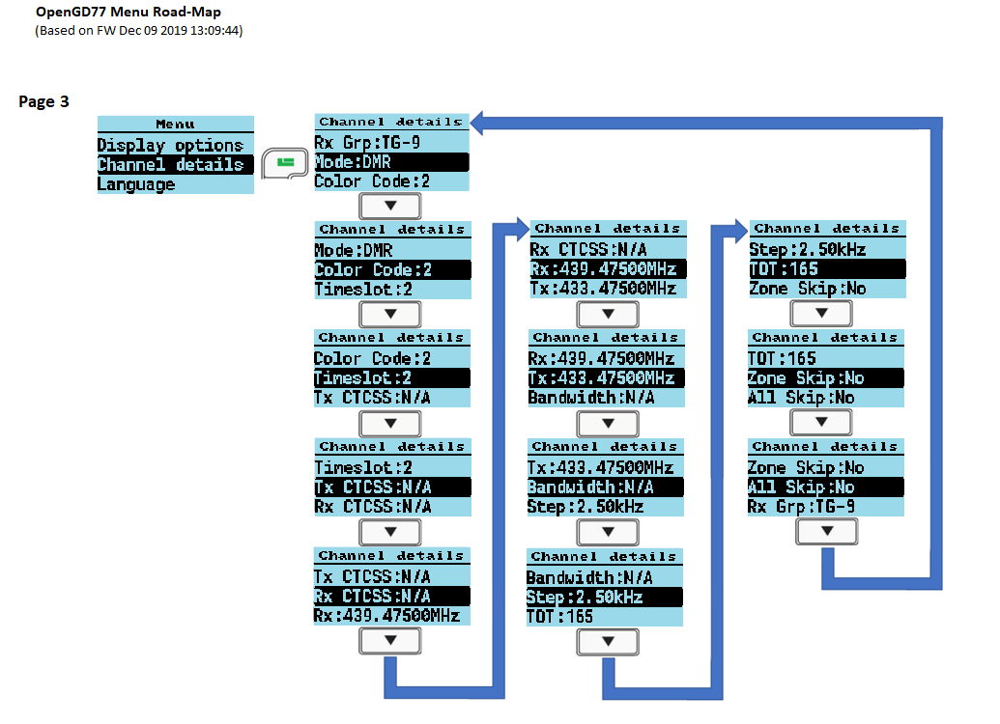

按压 **绿色** 按键可以进入主菜单，再次按压可进入子菜单或直接退出。  
按压 **红色** 按键可以返回上一级或直接退出。  
按压 **上** 或 **下** 方向键可浏览菜单各选项。  
按压 **左** 或 **右** 方向键可以更改菜单选项的值。

位于电台左侧的 **蓝色** 按键，或称为 **蓝色多功能键** ，通常会与其他按键搭配使用。  
按压电台顶部的 **橙色** 按键可以访问快捷菜单。

## 主菜单

### 区域（Zone）

区域菜单用于选择不同信道区域，该菜单与原装固件非常相似，但有一点不同。

除了您事先在写频软件中定义的区域之外，本固件还会创建一个特殊区域叫做 **全部信道（All Channels）**

当您选择 **全部信道（All Channels）** 这个特殊区域后，主屏幕下方会显示“All Channels”与信道编号。

按压 **上** 或 **下** 方向键可以浏览所有信道。  
按住 **蓝色功能键** 再使用上下方向键可以在不同区域之间快速切换。  
在全部信道区域中，按压任意数字按键可以进入信道跳转模式。

在该模式下，您可以输入想要跳转的信道编号，按压 **绿色** 按键以确认，或 **红色** 按键以取消。

### 信号强度指示器（RSSI）

本菜单会显示一个S表与具体RSSI数值（以dBm为单位）

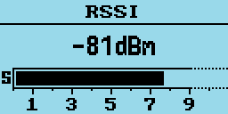

*请注意 :*  
RSSI读数与S表并未经过精确校准，在不同电台上，准确度会有所变化。  
由于DMR信号属于脉冲信号，因此在接收到DMR信号时，电台显示的RSSI数值并不准确。  
屏幕右上角的数字是由电台硬件直接报告的数值，仅用于开发用途。

### 电池（Battery）

显示当前电池电压。

按压 **下** 方向键可以显示电池使用情况表。横坐标每一格代表十分钟。

### 回溯界面（Last Heard）

显示电台最近接收到的16个DMR台站。

按压 **上** 或 **下** 方向键，可以浏览这些台站。
按住 **蓝色功能键** 可以查看详细信息。

### 固件信息（Firmware Info）

显示固件编译的时间与日期，方括号内是Github的commit code。

请在Github查看源码：
https://github.com/rogerclarkmelbourne/OpenGD77/commit/

可以使用commit code查看具体版本修改内容：
https://github.com/rogerclarkmelbourne/OpenGD77/commit/a0ebbc7

### 选项设定（Options）

选项设定菜单用于更改固件本身的诸多设置

#### 恢复出厂设置（Fact Reset）

恢复电台所有的设置到默认状态，同时读取VFO A到主屏幕。  
重启电台以生效。

**按住蓝色多功能键并打开电台同样可以恢复出厂设置**

#### 校准参数（Calibration）

打开或关闭校准参数，默认关。

有些电台似乎含有无效的校准数据，有可能是因为官方固件的校准数据已经占用了机内闪存，导致本固件默认的校准数据无效。

更改本设定需要重启电台生效。

若您的电台发射接收不正常，或在使用热点时不太正常（例如误码率奇高），试着关闭本设定并重启电台，因为本固件默认的校准参数在使用时已经够好，基本上与精确校准的参数比没有太大差别。

#### 波段限制（Band Limits）

打开或关闭发射波段限制，本功能打开时会禁止您在非业余段发射，默认开。

#### 按键长按时间（Key long）

本设置控制您按压某个特定按键多久后会被认为是长按。

#### 按键重复速度（Key rpt）

本设置控制您按住某个特定按键后该按键的重复速度。

#### 时隙驻留时间（Filter time）

本功能仅在时隙过滤关闭（**Filter: Off**）时有效。它决定了电台在轮询时每个时隙时的驻留时间。  
为了防止在某一时隙存在较长时间空闲的时候错过这个时隙上的信息，您可以把驻留时间调得长一些。  
当时隙过滤功能打开（**Filter: TS**）时，本功能没有任何作用。

#### 扫描驻留时间（Scan delay）

在扫描时，本设置控制电台驻留某个活动信道的时长。只有当扫描模式选择为“暂停”（**Scan mode: Pause**）时本设置才有效。

#### 扫描模式（Scan mode）

本设置控制在扫描时遇到某个活动信道后电台的行为。  
“保持”（**Hold**）会使电台一直驻留在一个活动信道上。  
“暂停”（**Pause**）会使电台驻留在一个活动信道一段时间后继续扫描。

#### UHF静噪（Squelch UHF）

本设置控制70cm波段默认的模拟信道或VFO静噪等级，默认45%。

#### 220M静噪（Squelch 220）

同上，控制220MHz段默认模拟信道或VFO静噪等级，默认45%。

#### VHF静噪（Squelch VHF）

同上，控制2m段默认模拟信道或VFO静噪等级，默认45%。

#### PTT保持（PTT Latch）

当本功能开启时，按压PTT可以在发射与接收之间切换。所以您不需要一直按住PTT以发射。

*请注意 :* 为了避免在不知情的情况下持续发射，PTT保持功能仅在超时计时器（TOT）已经启用的情况下才能使用。

#### 热点模式（Hotspot）

**热点模式并不支持DM-5R，因为在发射时，其电台硬件无法保证一个可靠的USB通信**

本设置控制当连接到MMDVM主机时是否进入热点模式，这包括Pi-Star或BlueDV。

可选项有：  
**Off** 关闭，不用于热点模式  
**MMDVM**  用于Pi-Star或其他MMDVM主机  
**BlueDV** 用于BlueDV  

在MD730上，若想要使用热点模式，请按住 **黑色侧键** 并打开电源，电台会在 **MMDVM** 与 **BlueDV** 模式之间切换。

#### 发射别名（TA Tx）

开启别名数据发射功能。

*请注意 :* 别名接收功能无论何时总在工作。请不要因为没有接收到别名就打开这个功能，本功能并不控制别名接收功能！

别名数据会使用写频软件中“Boot Item”定义的“Line1”与“Line2”进行发射，两行之间没有空格。

*请注意 :* 在摩托罗拉系统的中继台与网络中使用本功能会造成各种问题。请将本功能尽量用于直频或Brandmeister等支持别名数据的网络通联。

#### 允许单呼（Allow PC）

允许接收单呼

### 显示设定（Display Options）

#### 背光亮度（Brightness）

本固件允许用户控制背光亮度，设置范围可以从0%~100%，其中10%~100%以10%步进调整，0%~10%以1%步进调整。  
按压 **左** 或 **右** 方向键以更改设置，默认设置为100%

#### 待机亮度（Min Bright）

本设置控制电台待机时的屏幕亮度，默认设置为0%，这意味着在电台待机时屏幕将不会开启背光。

#### 对比度（Contrast）

本固件允许用户修改屏幕对比度，较低的数值意味着更淡的文字显示，较高的数值意味着更黑的文字显示，但同时还会使屏幕背景变得更黑。

#### 背光模式（Display mode）

控制屏幕背光模式

**Auto** 自动，背光会根据不同事件而自动点亮，例如接收到信号或按压某个按键。

**Squelch** 静噪，背光会在静噪打开，或接收到DMR信号时点亮，在信号消失后延时关闭背光。该时间由背光延时计时器决定，最短不少于五秒。

**Manual** 手动，由用户开启或关闭背光。按压 **黑色** 侧键以打开或关闭背光。

**None** 无，不开启背光。

#### 背光延时（Timeout）

背光延时计时器，用以控制背光在多久后关闭，默认无，即不会关闭。

#### 显示颜色模式（Colour mode）

本设置允许您将屏幕设置为反色或正常。反色为背景黑色，字母白色；正常为背景白色，字母黑色。

*请注意 :* 本功能并不能做到和MD760黑色液晶版本完全相同的效果，因为黑色液晶版本使用了与普通正常LCD不同的屏幕，因此其黑色背景色是原生的。

#### 联系人显示顺序（Order）

本设置决定了联系人数据是按什么顺序查找的

**Cc** = 联系人列表  
**Db** = 内置DMR ID数据库  
**TA** = 别名数据  

默认顺序为 Cc/Db/TA，意味着当收到一个DMR ID时，电台首先会在联系人列表中查找对应联系人，再从写入的DMR ID数据库中查找，若都未找到且主叫别名数据存在，则会显示主叫别名。

#### 联系人显示方式（Contact）

本设置控制了DMR呼号或名字等显示在屏幕上的位置。  
可选项有：

**1 Line** 一行，仅使用屏幕中间一行显示呼号与名字，当显示超过16个字符的别名时，多余字母将被舍弃。

**2 Lines** 两行，呼号显示在屏幕中间一行，姓名以及其他信息显示在屏幕底部一行。本固件会根据空格自动切割呼号与姓名。

**Auto** 自动，若呼号与姓名不超过16个字符（即能完整显示在中间一行）则电台仅显示中间一行；若呼号姓名或别名等超过16个字符时，则显示两行。

默认设置为**1 Line**

### 声音设定（Sound Options）

#### 超时警告（Timeout beep）

本设置控制电台是否在超时定时器归零，或即将归零时时发出“滴~”的警告音。

#### 警告音量（Beep volume）

本设置控制超时警告与其他提示音的音量。  
可选从-24dB ~ 6dB 以 3dB 为步进进行调整。

####  DMR提示音（DMR Beep）

本设置控制了接通DMR中继或结束发射时的提示音，可选项有：

**Start** 接通，仅当接通中继台时发出提示音  
**Stop** 结束，仅当结束发射时发出提示音  
**None** 无，不发出任何提示音  
**Both** 两者都，接通与结束时都发出提示音

*请注意 :* 接通DMR中继台时发出的提示音是用于确认您已经成功唤醒了中继台，该提示音只会在您电台的扬声器中播放而不会同时以语音数据发射出去。

#### DMR麦克风增益（DMR mic）

本设置控制了DMR模式下的麦克风增益，更改本设置不会影响FM模式下的麦克风增益。  
可选从 -33dB ~ 12dB 以 3dB 为步进进行调整。  
默认设置为0dB，即与原装固件一致。

#### FM麦克风增益（FM mic）

本设置控制了FM模式下的麦克风增益。可选从-15 ~ 15 以 1 为步进进行调整，负值代表比原装固件更少的增益，零代表相同，正值则代表更多。

顺带一提，由于参数的单位暂时无法确认，本设置参数没有单位。

#### VOX阈值（VOX threshold）

本设置决定了当VOX（声控发射）开启时触发电台发射的阈值。

#### VOX延迟（VOX Tail）

本设置决定了当声音低于VOX阈值后多久电台才停止发射。

### 信道详细设置（Channel Details）

#### 接收频率（RX）

设置当前接收频率，也可使用数字键盘快速输入。

#### 发射频率（TX）

设置当前发射频率，可使用数字键盘快速输入。

#### 模式（Mode）

选择FM（模拟）或DMR（数字）。

#### 色码（Color Code）

设置DMR使用的颜色码。

#### 时隙（Timeslot）

设置DMR使用的时隙。

#### 接收/发射组（Tx/RX Grp）

设置当前DMR信道指定了哪些接收/发射组。

#### 发射哑音（Tx CTCSS or DCS）

设置当前FM信道/VFO使用的发射哑音。

#### 接收哑音（Rx CTCSS or DCS）

设置当前FM信道/VFO使用的接收哑音。

*提示 :* 对于发射与接收哑音，长按 **左** 或 **右** 方向键可以连续跳转。按住 **蓝色多功能键** 再按压 **左** 或 **右** 方向键可直接跳转到CTCSS/DCS/DCSN开头或末尾。

#### 带宽（Bandwidth）

设置当前FM信道带宽，可选项有：25Khz, 12.5Khz。

#### 步进（Step）

设置信道/VFO频率步进。

#### 超时定时器（TOT）

打开或关闭发射超时定时器。

#### 跳过区域（Zone Skip）

设置是否在扫描时跳过该信道所在区域。

#### 跳过信道（All Skip）

设置是否在全频道扫描时跳过该信道。

#### 声控发射（VOX）

设置是否打开声控发射。

#### 保存对信道的更改

按压 **绿色** 按键以确认更改。

按压 **蓝色多功能键+绿色** 组合键以保存信道/VFO更改至电台的配置文件。

按压 **红色** 按键以取消更改并退出。

### 致谢（Credits）

显示参与本固件编写的开发者详细名字与呼号

若将来有更多开发者贡献在这个项目中，他们的名字会被添加进去，按压 **下** 方向键以查看更多。

到本章节为止，关于电台所有设置以及选项已基本解释完毕。  
这里是翻译BH4ESK与校对BG5IPF，感谢您认真阅读本指南。

## 发起或接收单呼

### 想要发起单呼的话

在任意信道或VFO界面：

1. 按压数字键盘井号键两次进入单呼ID输入界面，屏幕上部显示“PC entry”。
2. 输入想要呼叫的DMR ID，例如5053238。
3. 按压**绿色**按键确认，或按压**红色**按键退出。

*请注意 :* 若您在输入ID时输错了一位，按压**左**方向键可以删除一位数字。

若您输入的DMR ID在内置的数据库内，对应的呼号与名字会显示在屏幕上。

若ID不在数据库内，则只会显示ID号码本身。

**此时电台已进入单呼模式。**

若想回到原来的模式，有以下三个方法：

1. 按压 **蓝色多功能键+红色** 组合键。

2. 按压 **左** 或 **右** 方向键以切换到其他通话组。

3. 按压数字键盘井号键，并输入通话组代码，按压 **绿色** 按键确认。

*请注意 :* 当您处于单呼模式时，通过菜单切换信道或VFO都不会使您退出单呼模式。

### 当接收到一个单呼时

当您接收到一个单呼时，电台会显示以下界面。

屏幕中间会显示主叫呼号与姓名（或ID）

若想要使电台接受单呼并呼回主叫电台，请按 **绿色** 按键以接受；您可以按 **红色** 按键或不理会该提示以拒绝本次呼叫。

若您接收了此次呼叫，则电台会自动切换至单呼模式，同时显示对方的呼号，名字等信息，等待您发射。界面如下：

当您的单呼操作结束后，按压 **蓝色功能键+红色** 组合键可以回到之前的通话组。（或上一节描述的三种方法之一种） 

## 热点模式（Hotspot mode）

**重要信息**

**热点模式目前不支持宝峰DM5R，因为在DM5R发射时无法保证稳定的USB通信**

* 在使用热点模式的时候，连接电台与主机的USB线 **必须** 进行适当保护以避免射频干扰，否则在电台发射时可能会造成USB连接被重置，进而导致热点模式停止工作。
* **不要** 使用原机的天线进行热点模式操作，这样造成的射频干扰问题没法简单的用一个磁环来解决。
* 连接一个外部天线。
* 在USB线缆两端加个磁环以保护线缆免受射频干扰。
* 如果您使用树莓派作为主机，请使用一个封闭的铁壳保护树莓派。

当您使用USB写频线连接到一个MMDVM主机，例如PiStar时，电台就可作为一个DMR语音热点工作。

*请注意 :* 热点模式同时也兼容类似于BlueDV这样的软件，但也有可能无法使用。

想要使用热点模式的话，请先使用写频线连接电台与主机，如图。

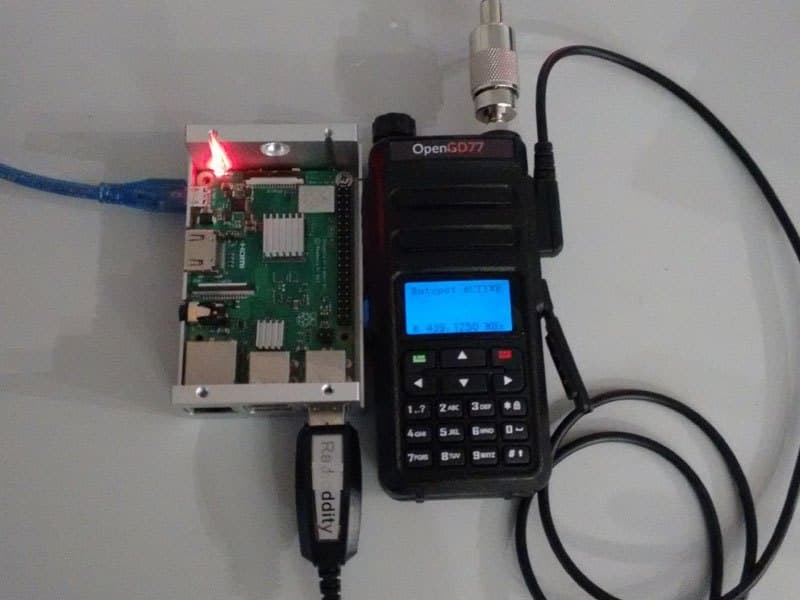

热点模式也支持树莓派Zero/Zero W，不过您可能需要一条OTG线缆。

在PiStar配置界面，Radio/Modem Type 一栏选择 “OpenGD77 DMR hotspot (USB)”

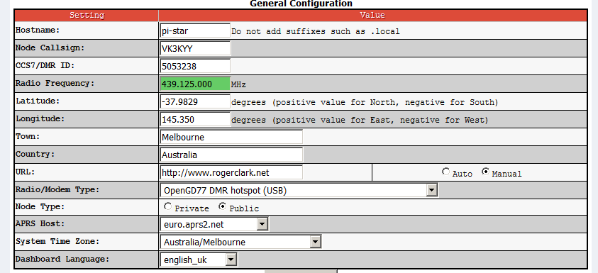

若您的PiStar并没有这个选项，请更新您的PiStar。

当您正确连接后，按住电台的 **黑色** 侧键并打开电源。若PiStar配置正确，您电台屏幕的顶部会显示 “Hotspot” 以提示您已进入热点模式，同时电池电量、色码、功率和接收频率也都会显示，如图。

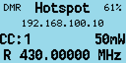

若电台没有进入热点模式，重启电台和PiStar并重试。

如果此时电台还无法进入热点模式，请检查USB连接。

*请注意 :* 默认情况下PiStar会将电台功率配置为“100”，您可以在专家模式下的MMDVMHost settings更改。

“100”的设定代表了PiStar期望电台输出100%的功率，对于您的电台来说也就是5W满功率输出。显然的，您手中的电台在设计时并未考量长时间、高功率、持续发射的工况。

您的电台所支持的满功率持续发射时间，会根据不同的操作环境，例如室内温度、天线驻波等等而有所变化。

设置一个适当的发射功率并确保电台不会过热或烧毁是您自己的责任。

为了保护电台，若PiStar向本固件汇报了“100”的功率设定，则电台会认为您没有正确配置PiStar并忽略该功率设定。此时固件会使用普通模式下您设置的功率进行发射。

若PiStar向本固件汇报了任何其他功率设定（例如“50”），则固件会选择对应最接近的功率进行发射。
以“50”为例，即5W的50%，等于2.5W，最接近这个值的功率设定是4W，因此电台会以4W进行发射。

电台发射功率 | PiStar RFLevel
--- | ---
50mW  | 1
250mW  | 5
500mW  |10
750mW  |15
1W  |  20
2W  | 40
4W  | 80
5W  | 99
5W++ | 不可用

由PiStar指定的接收频率会显示在屏幕底部。

*请注意 :* 在PiStar中请不要设置发射/接收频偏，因为您的电台不需要任何频偏设置，且任何频偏都会如实反映在接收频率上，因为PiStar实际上会发送已偏移的频率至您的电台。

当您的电台接收到一个射频DMR信号时，机器顶部的指示灯会亮起绿色，主叫呼号及名称（或DMR ID，如果没有查询到ID对应的呼号数据的话）、通话组、接收频率都会显示在电台屏幕上。

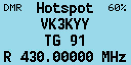

当PiStar接收到来自网络的信号并触发您的电台进入发射时，机器顶部的指示灯会亮起红色，屏幕上同样会显示主叫呼号及名称/DMR ID，以及发射频率。

## 重设电台各项设定

按住电台侧边的 **蓝色多工能键** 并打开电台可以恢复各项设定到默认状态。

按住电台侧边的 **蓝色多工能键+上方向键+下方向键** 并打开电台可以清除自定义的开机画面和开机声音。

在MD730上，按住电台侧边的 **蓝色多工能键+橙色** 并打开电台可以清除自定义的开机声音。

## 关于MD730的操作方式

若您要配合MD730使用本固件，**必须** 使用写频软件写入语音提示。若您不写入语音提示，则电台不会发出任何提示音，这样的情况下几乎无法使用MD730.

请参阅相关章节以了解如何写入语音提示。

MD730在机顶有一个音量/开关钮与一个16位置的旋钮。这个16位置的旋钮用于选择当前区域的信道。尽管新版写频软件允许您在一个区域内写入多达80个信道，但是MD730只能访问前16个信道，我们推荐配合MD730使用时尽量将每个区域信道控制在16个以内。

MD730除了没有屏幕与键盘区以外，其侧边按键与MD760一样，在此不赘述。

本固件对于MD730的使用提出了“控制模式”概念。在不同“控制模式”中黑色与蓝色按键各自拥有不同的功能，通过按压机顶 **橙色** 按键可以在不同模式之间切换。

### MD730 信道/通话组模式

本模式的语音提示是 "Channel mode".  
在本模式中，黑色与蓝色按键用于浏览当前信道以及其指定通话组。

### MD730 扫描模式

本模式与普通版本固件中的信道扫描一样。按压黑色侧键可以开始或结束扫描。

### MD730 时隙模式

在本模式下按压黑色或蓝色侧键可以在时隙1与时隙2之间切换。

### MD730 色码模式

在本模式下，按压黑色侧键可以使色码递增，按压蓝色按键可以递减。

### MD730 DMR过滤模式

在本模式下，按压黑色侧键可以向上更改DMR模式的过滤设置，按压蓝色侧键则向下更改。请查看 [DMR模式的过滤设置](#dmr模式的过滤设置)

### MD730 区域模式

在本模式下，按压黑色侧键可以选择上一个区域，按压蓝色侧键则选择下一个区域。

### MD730 功率模式

在本模式下，按压黑色侧键可以提高一档功率，按压蓝色侧键可以减少一档功率。

*请注意 :* 与之前所说一致，功率设定数值仅在您校准了功率之后才会准确。

# 关于OpenGD77 CPS写频软件的说明

> *译者注：关于写频软件内容较多，翻译工作正在进行。
